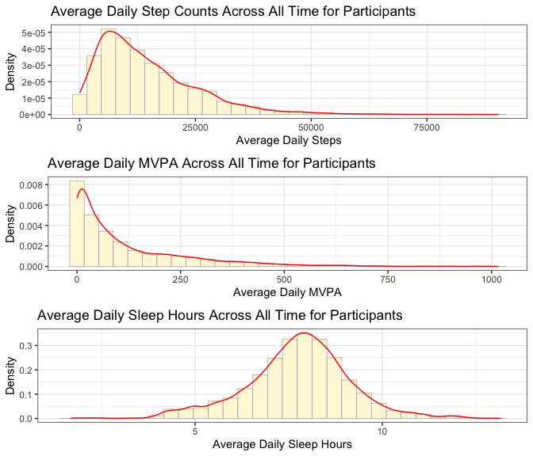

Wearables Pre-Post Data Report
================
Laura Graham
2025-06-23

- [Summary](#summary)
  - [Notes](#notes)
  - [Data Frame Summary](#data-frame-summary)
  - [Summary of Participants Included in Wearables
    Analysis](#summary-of-participants-included-in-wearables-analysis)
  - [Distribution of Daily Wearable
    Measures](#distribution-of-daily-wearable-measures)

# Summary

DCI participants take an average of 1.4556^{4} steps per day which
includes an average of 119 minutes of moderate to vigorous physical
activity (MVPA).

## Notes

All models include a random effect for the participant and are adjusted
for device type used to capture the data.

## Data Frame Summary

This is a summary of all data included in the final analytic sample.

Unit of analysis is the participant-day. Total number is the number of
participant day with at least one steps, MVPA, or sleep measured.

|                                                  |        |
|:-------------------------------------------------|:-------|
| Name                                             | daily2 |
| Number of rows                                   | 7979   |
| Number of columns                                | 42     |
| \_\_\_\_\_\_\_\_\_\_\_\_\_\_\_\_\_\_\_\_\_\_\_   |        |
| Column type frequency:                           |        |
| character                                        | 8      |
| factor                                           | 5      |
| numeric                                          | 26     |
| POSIXct                                          | 3      |
| \_\_\_\_\_\_\_\_\_\_\_\_\_\_\_\_\_\_\_\_\_\_\_\_ |        |
| Group variables                                  | None   |

Data summary

**Variable type: character**

| skim_variable | n_missing | complete_rate | min | max | empty | n_unique | whitespace |
|:--------------|----------:|--------------:|----:|----:|------:|---------:|-----------:|
| ID            |         0 |             1 |  21 |  21 |     0 |       30 |          0 |
| Times         |         0 |             1 |  23 |  41 |     0 |        4 |          0 |
| gender        |        18 |             1 |   4 |   6 |     0 |        2 |          0 |
| education     |        18 |             1 |  23 |  74 |     0 |        4 |          0 |
| Usborn        |        18 |             1 |   2 |   3 |     0 |        2 |          0 |
| married       |        18 |             1 |   7 |  18 |     0 |        3 |          0 |
| selfemployed  |        18 |             1 |   2 |   3 |     0 |        2 |          0 |
| Q156_1        |        18 |             1 |   9 |  34 |     0 |        3 |          0 |

**Variable type: factor**

| skim_variable | n_missing | complete_rate | ordered | n_unique | top_counts |
|:---|---:|---:|:---|---:|:---|
| Pre.Post | 0 | 1 | FALSE | 2 | Pos: 5484, Pre: 2495 |
| rate_health | 18 | 1 | FALSE | 3 | Ver: 3723, Goo: 2401, Exc: 1837, Fai: 0 |
| Q127 | 18 | 1 | TRUE | 4 | Mor: 6403, Onc: 943, Har: 503, Nev: 112 |
| Q129 | 18 | 1 | TRUE | 3 | Mor: 7412, Onc: 380, One: 169, Har: 0 |
| Q153 | 18 | 1 | TRUE | 4 | Oft: 4207, Alw: 1854, Som: 1182, Rar: 718 |

**Variable type: numeric**

| skim_variable | n_missing | complete_rate | mean | sd | p0 | p25 | p50 | p75 | p100 | hist |
|:---|---:|---:|---:|---:|---:|---:|---:|---:|---:|:---|
| Total_Steps | 985 | 0.88 | 14555.99 | 10881.01 | 8.00 | 6547.00 | 11969.50 | 19906.75 | 90429.00 | ▇▃▁▁▁ |
| Total_MVPA | 1707 | 0.79 | 119.01 | 149.10 | 0.00 | 10.89 | 60.38 | 174.02 | 1015.80 | ▇▂▁▁▁ |
| Total_Sleep | 3236 | 0.59 | 7.75 | 1.40 | 1.67 | 7.00 | 7.82 | 8.58 | 13.17 | ▁▂▇▃▁ |
| HR_Avg | 1219 | 0.85 | 76.24 | 11.59 | 46.55 | 69.27 | 74.98 | 82.18 | 139.18 | ▂▇▂▁▁ |
| HR_Max | 1219 | 0.85 | 132.22 | 21.38 | 50.00 | 119.00 | 132.00 | 145.00 | 213.00 | ▁▂▇▂▁ |
| HR_n | 1219 | 0.85 | 12013.89 | 15516.04 | 1.00 | 498.00 | 1348.00 | 32688.50 | 45621.00 | ▇▁▁▂▁ |
| Moderate | 1219 | 0.85 | 102.60 | 141.23 | 0.00 | 5.47 | 45.12 | 145.47 | 960.00 | ▇▂▁▁▁ |
| Vigorous | 1219 | 0.85 | 7.81 | 14.67 | 0.00 | 0.02 | 1.18 | 8.58 | 129.40 | ▇▁▁▁▁ |
| Cohort | 0 | 1.00 | 2024.00 | 0.00 | 2024.00 | 2024.00 | 2024.00 | 2024.00 | 2024.00 | ▁▁▇▁▁ |
| Surv_year | 18 | 1.00 | 2024.00 | 0.00 | 2024.00 | 2024.00 | 2024.00 | 2024.00 | 2024.00 | ▁▁▇▁▁ |
| birth_year | 18 | 1.00 | 1960.42 | 6.39 | 1947.00 | 1957.00 | 1960.00 | 1965.00 | 1973.00 | ▂▃▇▂▃ |
| Age | 18 | 1.00 | 63.58 | 6.39 | 51.00 | 59.00 | 64.00 | 67.00 | 77.00 | ▃▂▇▃▂ |
| children_living2 | 18 | 1.00 | 2.17 | 0.94 | 0.00 | 2.00 | 2.00 | 3.00 | 4.00 | ▂▁▇▇▁ |
| work_years | 130 | 0.98 | 14.15 | 11.00 | 1.00 | 6.00 | 12.00 | 20.00 | 40.00 | ▇▂▅▁▂ |
| Big5_Agreeable | 18 | 1.00 | 3.36 | 0.37 | 2.67 | 3.17 | 3.33 | 3.67 | 4.00 | ▅▇▃▇▅ |
| Big5_Conscientious | 18 | 1.00 | 3.55 | 0.31 | 2.86 | 3.43 | 3.57 | 3.86 | 4.00 | ▅▁▆▇▇ |
| Big5_Extravert | 18 | 1.00 | 2.87 | 0.42 | 2.17 | 2.67 | 2.83 | 3.17 | 3.83 | ▇▇▆▃▃ |
| Big5_Neurotic | 18 | 1.00 | 2.05 | 0.30 | 1.17 | 2.00 | 2.17 | 2.17 | 2.67 | ▁▂▇▇▂ |
| Big5_Open | 18 | 1.00 | 3.07 | 0.29 | 2.17 | 2.83 | 3.17 | 3.17 | 3.83 | ▂▃▂▇▂ |
| UCLA_Loneliness3 | 18 | 1.00 | 4.29 | 1.37 | 3.00 | 3.00 | 4.00 | 6.00 | 7.00 | ▇▂▂▅▁ |
| UCLA_Loneliness_Rev | 778 | 0.90 | 16.47 | 3.25 | 12.00 | 14.00 | 15.00 | 19.00 | 23.00 | ▇▆▃▂▃ |
| Need_for_Cognition | 18 | 1.00 | 2.88 | 0.28 | 2.17 | 2.67 | 2.83 | 3.00 | 4.00 | ▁▇▇▁▁ |
| Ryff_Purpose | 18 | 1.00 | 5.32 | 0.86 | 3.33 | 4.80 | 5.60 | 6.00 | 6.67 | ▂▃▅▇▃ |
| Telomere.Values | 2862 | 0.64 | 7.00 | 0.17 | 6.71 | 6.85 | 7.02 | 7.13 | 7.31 | ▆▇▆▇▅ |
| OMICmAge | 2862 | 0.64 | 63.37 | 4.84 | 54.58 | 57.42 | 64.50 | 66.66 | 70.70 | ▇▁▅▇▆ |
| Decimal.Chronological.Age | 2862 | 0.64 | 63.53 | 5.77 | 52.90 | 58.97 | 64.17 | 64.87 | 76.25 | ▅▅▇▃▂ |

**Variable type: POSIXct**

| skim_variable | n_missing | complete_rate | min | max | median | n_unique |
|:---|---:|---:|:---|:---|:---|---:|
| date | 0 | 1.00 | 2024-05-17 00:00:00 | 2025-05-31 00:00:00 | 2024-11-13 00:00:00 | 380 |
| Sleep_Start | 2503 | 0.69 | 2024-05-17 00:48:00 | 2025-05-31 01:24:05 | 2024-11-11 21:39:31 | 5042 |
| Sleep_End | 2503 | 0.69 | 2024-05-17 00:50:39 | 2025-05-31 01:35:00 | 2024-11-12 00:06:55 | 5094 |

## Summary of Participants Included in Wearables Analysis

<table class="gt_table" data-quarto-disable-processing="false" data-quarto-bootstrap="false">
  <thead>
    &#10;    <tr class="gt_col_headings">
      <th class="gt_col_heading gt_columns_bottom_border gt_left" rowspan="1" colspan="1" scope="col" id="&lt;strong&gt;Characteristic&lt;/strong&gt;"><strong>Characteristic</strong></th>
      <th class="gt_col_heading gt_columns_bottom_border gt_center" rowspan="1" colspan="1" scope="col" id="&lt;strong&gt;N = 30&lt;/strong&gt;&lt;span class=&quot;gt_footnote_marks&quot; style=&quot;white-space:nowrap;font-style:italic;font-weight:normal;&quot;&gt;&lt;sup&gt;1&lt;/sup&gt;&lt;/span&gt;"><strong>N = 30</strong>1</th>
    </tr>
  </thead>
  <tbody class="gt_table_body">
    <tr><td headers="label" class="gt_row gt_left">Average Daily Steps</td>
<td headers="stat_0" class="gt_row gt_center">10,206 (6,432, 15,914)</td></tr>
    <tr><td headers="label" class="gt_row gt_left">Average Daily Minutes of Moderate to Vigorous Physcial Activity (MVPA)</td>
<td headers="stat_0" class="gt_row gt_center">64 (43, 237)</td></tr>
    <tr><td headers="label" class="gt_row gt_left">    Unknown</td>
<td headers="stat_0" class="gt_row gt_center">2</td></tr>
    <tr><td headers="label" class="gt_row gt_left">Average Daily Sleep Hours</td>
<td headers="stat_0" class="gt_row gt_center">7.63 (7.09, 8.11)</td></tr>
    <tr><td headers="label" class="gt_row gt_left">    Unknown</td>
<td headers="stat_0" class="gt_row gt_center">5</td></tr>
    <tr><td headers="label" class="gt_row gt_left">Earliest Recorded Date</td>
<td headers="stat_0" class="gt_row gt_center">2024-05-17 to 2024-09-25</td></tr>
    <tr><td headers="label" class="gt_row gt_left">Last Recorded Date</td>
<td headers="stat_0" class="gt_row gt_center">2024-06-15 to 2025-05-31</td></tr>
    <tr><td headers="label" class="gt_row gt_left">Days of Observation</td>
<td headers="stat_0" class="gt_row gt_center">353 (249, 369)</td></tr>
    <tr><td headers="label" class="gt_row gt_left">Sex</td>
<td headers="stat_0" class="gt_row gt_center"></td></tr>
    <tr><td headers="label" class="gt_row gt_left">    Female</td>
<td headers="stat_0" class="gt_row gt_center">16 (55%)</td></tr>
    <tr><td headers="label" class="gt_row gt_left">    Male</td>
<td headers="stat_0" class="gt_row gt_center">13 (45%)</td></tr>
    <tr><td headers="label" class="gt_row gt_left">    Unknown</td>
<td headers="stat_0" class="gt_row gt_center">1</td></tr>
    <tr><td headers="label" class="gt_row gt_left">Age, years</td>
<td headers="stat_0" class="gt_row gt_center">64 (59, 67)</td></tr>
    <tr><td headers="label" class="gt_row gt_left">    Unknown</td>
<td headers="stat_0" class="gt_row gt_center">1</td></tr>
    <tr><td headers="label" class="gt_row gt_left">US born</td>
<td headers="stat_0" class="gt_row gt_center">18 (62%)</td></tr>
    <tr><td headers="label" class="gt_row gt_left">    Unknown</td>
<td headers="stat_0" class="gt_row gt_center">1</td></tr>
    <tr><td headers="label" class="gt_row gt_left">Marital Status</td>
<td headers="stat_0" class="gt_row gt_center"></td></tr>
    <tr><td headers="label" class="gt_row gt_left">    Divorced</td>
<td headers="stat_0" class="gt_row gt_center">1 (3.4%)</td></tr>
    <tr><td headers="label" class="gt_row gt_left">    Married</td>
<td headers="stat_0" class="gt_row gt_center">26 (90%)</td></tr>
    <tr><td headers="label" class="gt_row gt_left">    Never been married</td>
<td headers="stat_0" class="gt_row gt_center">2 (6.9%)</td></tr>
    <tr><td headers="label" class="gt_row gt_left">    Unknown</td>
<td headers="stat_0" class="gt_row gt_center">1</td></tr>
    <tr><td headers="label" class="gt_row gt_left">Number of Children</td>
<td headers="stat_0" class="gt_row gt_center"></td></tr>
    <tr><td headers="label" class="gt_row gt_left">    0</td>
<td headers="stat_0" class="gt_row gt_center">3 (10%)</td></tr>
    <tr><td headers="label" class="gt_row gt_left">    1</td>
<td headers="stat_0" class="gt_row gt_center">2 (6.9%)</td></tr>
    <tr><td headers="label" class="gt_row gt_left">    2</td>
<td headers="stat_0" class="gt_row gt_center">13 (45%)</td></tr>
    <tr><td headers="label" class="gt_row gt_left">    3</td>
<td headers="stat_0" class="gt_row gt_center">10 (34%)</td></tr>
    <tr><td headers="label" class="gt_row gt_left">    4</td>
<td headers="stat_0" class="gt_row gt_center">1 (3.4%)</td></tr>
    <tr><td headers="label" class="gt_row gt_left">    Unknown</td>
<td headers="stat_0" class="gt_row gt_center">1</td></tr>
    <tr><td headers="label" class="gt_row gt_left">Self-Employed</td>
<td headers="stat_0" class="gt_row gt_center">10 (34%)</td></tr>
    <tr><td headers="label" class="gt_row gt_left">    Unknown</td>
<td headers="stat_0" class="gt_row gt_center">1</td></tr>
    <tr><td headers="label" class="gt_row gt_left">Working Years</td>
<td headers="stat_0" class="gt_row gt_center">9 (6, 19)</td></tr>
    <tr><td headers="label" class="gt_row gt_left">    Unknown</td>
<td headers="stat_0" class="gt_row gt_center">2</td></tr>
    <tr><td headers="label" class="gt_row gt_left">Self-Rated Health at the Start of DCI</td>
<td headers="stat_0" class="gt_row gt_center"></td></tr>
    <tr><td headers="label" class="gt_row gt_left">    Excellent</td>
<td headers="stat_0" class="gt_row gt_center">7 (24%)</td></tr>
    <tr><td headers="label" class="gt_row gt_left">    Very Good</td>
<td headers="stat_0" class="gt_row gt_center">14 (48%)</td></tr>
    <tr><td headers="label" class="gt_row gt_left">    Good</td>
<td headers="stat_0" class="gt_row gt_center">8 (28%)</td></tr>
    <tr><td headers="label" class="gt_row gt_left">    Fair</td>
<td headers="stat_0" class="gt_row gt_center">0 (0%)</td></tr>
    <tr><td headers="label" class="gt_row gt_left">    Poor</td>
<td headers="stat_0" class="gt_row gt_center">0 (0%)</td></tr>
    <tr><td headers="label" class="gt_row gt_left">    Unknown</td>
<td headers="stat_0" class="gt_row gt_center">1</td></tr>
  </tbody>
  &#10;  <tfoot class="gt_footnotes">
    <tr>
      <td class="gt_footnote" colspan="2">1 Median (IQR); Range; n (%)</td>
    </tr>
  </tfoot>
</table>

## Distribution of Daily Wearable Measures

<!-- -->
