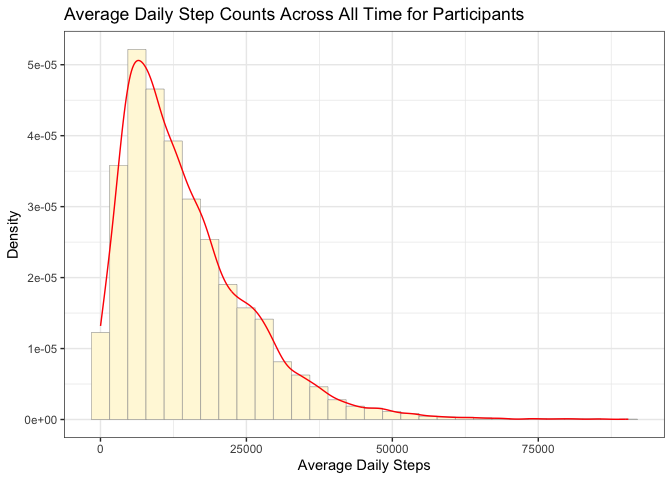
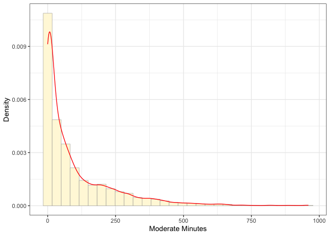
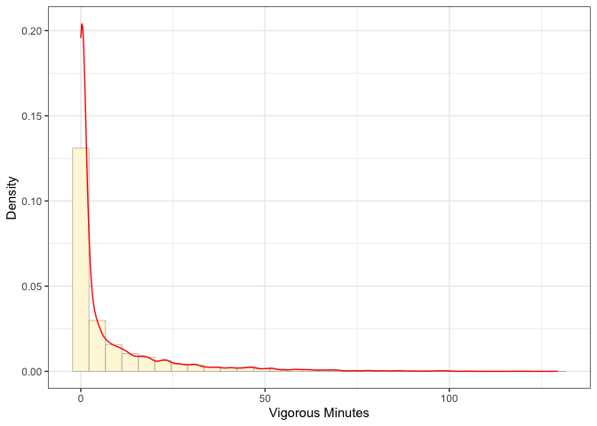
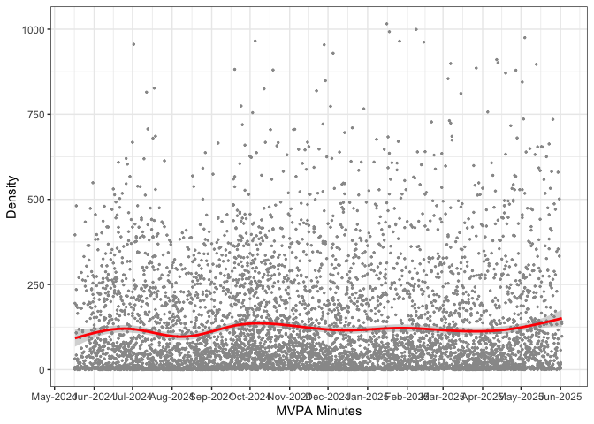
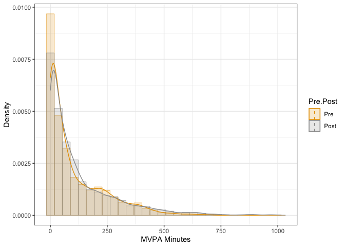
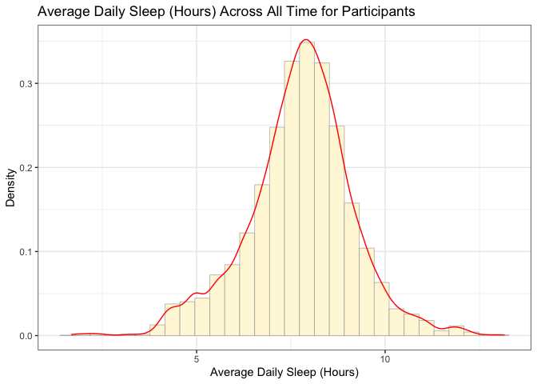
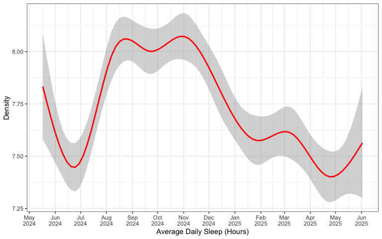
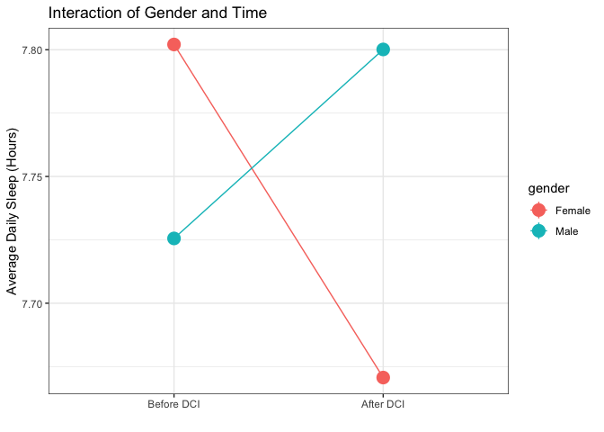

Wearables Pre-Post Data Report (06.20.2025)
================
Laura Graham
2025-06-22

- [Summary](#summary)
- [Notes](#notes)
- [Data Frame Summary](#data-frame-summary)
- [Step Count Analysis](#step-count-analysis)
  - [Distribution of Daily Step
    Counts](#distribution-of-daily-step-counts)
  - [Daily Step Counts by Time
    Period](#daily-step-counts-by-time-period)
  - [Plotting Change in Daily Steps Over
    Time](#plotting-change-in-daily-steps-over-time)
  - [Daily Steps by Device and Survey
    Responses](#daily-steps-by-device-and-survey-responses)
  - [Unadjusted and Adjusted model of Daily Step
    Counts](#unadjusted-and-adjusted-model-of-daily-step-counts)
  - [Difference in Effect of DCI on Step Count by
    Gender](#difference-in-effect-of-dci-on-step-count-by-gender)
- [Minutes of Moderate to Vigorous Activity
  (MVPA)](#minutes-of-moderate-to-vigorous-activity-mvpa)
  - [Total Daily Minutes of MVPA](#total-daily-minutes-of-mvpa)
  - [Distribution of Daily MVPA
    Minutes](#distribution-of-daily-mvpa-minutes)
  - [Change in MVPA Minutes Over
    Time](#change-in-mvpa-minutes-over-time)
  - [Distribution of MVPA by Time
    Period](#distribution-of-mvpa-by-time-period)
  - [Initial Table of Daily MVPA by Device and Survey
    Responses](#initial-table-of-daily-mvpa-by-device-and-survey-responses)
  - [Unadjusted and Adjusted Model of Daily
    MVPA](#unadjusted-and-adjusted-model-of-daily-mvpa)
- [Summary of Sleep Data](#summary-of-sleep-data)
  - [Distribution of Daily Sleep
    (Hours)](#distribution-of-daily-sleep-hours)
  - [Daily Sleep (Hours) by Time
    Period](#daily-sleep-hours-by-time-period)
  - [Plotting Change in Daily Sleep (Hours) Over
    Time](#plotting-change-in-daily-sleep-hours-over-time)
  - [Daily Sleep (Hours) by Device and Survey
    Responses](#daily-sleep-hours-by-device-and-survey-responses)
  - [Unadjusted and Adjusted model of Daily Sleep
    (Hours)](#unadjusted-and-adjusted-model-of-daily-sleep-hours)
  - [Difference in Effect of DCI on Step Count by
    Gender](#difference-in-effect-of-dci-on-step-count-by-gender-1)

# Summary

DCI participants take an average of 14,406 steps per day which includes
an average of 119 minutes of moderate to vigorous physical activity
(MVPA).

After starting DCI, only female participants see an increase in daily
step count (+1,193 steps per day). Male DCI participants reduce their
daily step counts by 2,219 steps after starting DCI.

MVPA increases across all participants by 18 minutes as compared to the
pre-Intro to DCI period.

# Notes

All models include a random effect for the participant and are adjusted
for device type used to capture the data.

# Data Frame Summary

|                                                  |        |
|:-------------------------------------------------|:-------|
| Name                                             | daily2 |
| Number of rows                                   | 9009   |
| Number of columns                                | 54     |
| \_\_\_\_\_\_\_\_\_\_\_\_\_\_\_\_\_\_\_\_\_\_\_   |        |
| Column type frequency:                           |        |
| character                                        | 17     |
| factor                                           | 5      |
| numeric                                          | 29     |
| POSIXct                                          | 3      |
| \_\_\_\_\_\_\_\_\_\_\_\_\_\_\_\_\_\_\_\_\_\_\_\_ |        |
| Group variables                                  | None   |

Data summary

**Variable type: character**

| skim_variable | n_missing | complete_rate | min | max | empty | n_unique | whitespace |
|:---|---:|---:|---:|---:|---:|---:|---:|
| TruDiagnosticID | 3171 | 0.65 | 19 | 19 | 0 | 19 | 0 |
| ID | 0 | 1.00 | 21 | 21 | 0 | 30 | 0 |
| Times | 0 | 1.00 | 20 | 41 | 0 | 5 | 0 |
| Last | 0 | 1.00 | 5 | 15 | 0 | 26 | 0 |
| First | 0 | 1.00 | 3 | 12 | 0 | 29 | 0 |
| F/P/A | 0 | 1.00 | 6 | 7 | 0 | 2 | 0 |
| Unique ID \# | 0 | 1.00 | 14 | 14 | 0 | 30 | 0 |
| Qualtrics ID \# | 0 | 1.00 | 12 | 12 | 0 | 30 | 0 |
| Biometric Key.myphdkey | 0 | 1.00 | 46 | 46 | 0 | 30 | 0 |
| Matched? | 0 | 1.00 | 7 | 7 | 0 | 1 | 0 |
| Match Crosswalk? | 0 | 1.00 | 7 | 7 | 0 | 1 | 0 |
| gender | 18 | 1.00 | 4 | 6 | 0 | 2 | 0 |
| education | 18 | 1.00 | 23 | 74 | 0 | 4 | 0 |
| Usborn | 18 | 1.00 | 2 | 3 | 0 | 2 | 0 |
| married | 18 | 1.00 | 7 | 18 | 0 | 3 | 0 |
| selfemployed | 18 | 1.00 | 2 | 3 | 0 | 2 | 0 |
| Q156_1 | 18 | 1.00 | 9 | 34 | 0 | 3 | 0 |

**Variable type: factor**

| skim_variable | n_missing | complete_rate | ordered | n_unique | top_counts |
|:---|---:|---:|:---|---:|:---|
| Pre.Post | 0 | 1 | FALSE | 2 | Pos: 5504, Pre: 3505 |
| rate_health | 18 | 1 | FALSE | 3 | Ver: 4017, Goo: 2849, Exc: 2125, Fai: 0 |
| Q127 | 18 | 1 | TRUE | 4 | Mor: 7343, Onc: 1032, Har: 504, Nev: 112 |
| Q129 | 18 | 1 | TRUE | 3 | Mor: 8343, Onc: 479, One: 169, Har: 0 |
| Q153 | 18 | 1 | TRUE | 4 | Oft: 4877, Alw: 2145, Som: 1190, Rar: 779 |

**Variable type: numeric**

| skim_variable | n_missing | complete_rate | mean | sd | p0 | p25 | p50 | p75 | p100 | hist |
|:---|---:|---:|---:|---:|---:|---:|---:|---:|---:|:---|
| Old ID | 0 | 1.00 | 2024520.39 | 10.83 | 2024501.00 | 2024512.00 | 2024522.00 | 2024528.00 | 2024542.00 | ▆▇▇▇▅ |
| Total_Steps | 992 | 0.89 | 14550.69 | 10698.29 | 8.00 | 6662.00 | 12102.00 | 19971.00 | 90429.00 | ▇▃▁▁▁ |
| Total_MVPA | 2106 | 0.77 | 116.15 | 146.28 | 0.00 | 9.93 | 58.02 | 172.01 | 1015.80 | ▇▂▁▁▁ |
| Total_Sleep | 3587 | 0.60 | 7.79 | 1.42 | 1.67 | 7.04 | 7.88 | 8.62 | 13.17 | ▁▂▇▃▁ |
| HR_Avg | 1499 | 0.83 | 75.80 | 11.52 | 46.55 | 68.84 | 74.43 | 81.67 | 139.18 | ▂▇▂▁▁ |
| HR_Max | 1499 | 0.83 | 132.54 | 21.22 | 50.00 | 119.00 | 132.00 | 145.00 | 213.00 | ▁▂▇▃▁ |
| HR_n | 1499 | 0.83 | 11108.01 | 15014.44 | 1.00 | 501.00 | 1270.00 | 29776.75 | 45621.00 | ▇▁▁▂▁ |
| Moderate | 1499 | 0.83 | 98.99 | 138.04 | 0.00 | 4.72 | 42.04 | 140.61 | 960.00 | ▇▂▁▁▁ |
| Vigorous | 1499 | 0.83 | 7.77 | 14.65 | 0.00 | 0.02 | 1.17 | 8.65 | 129.40 | ▇▁▁▁▁ |
| Empl ID | 0 | 1.00 | 6095429.81 | 1881250.75 | 1401330.00 | 5339077.00 | 6876348.00 | 6931899.00 | 9695618.00 | ▂▂▁▇▁ |
| Cohort | 0 | 1.00 | 2024.00 | 0.00 | 2024.00 | 2024.00 | 2024.00 | 2024.00 | 2024.00 | ▁▁▇▁▁ |
| F/P/A Cat | 0 | 1.00 | 1.31 | 0.46 | 1.00 | 1.00 | 1.00 | 2.00 | 2.00 | ▇▁▁▁▃ |
| Surv_year | 18 | 1.00 | 2024.00 | 0.00 | 2024.00 | 2024.00 | 2024.00 | 2024.00 | 2024.00 | ▁▁▇▁▁ |
| birth_year | 18 | 1.00 | 1960.36 | 6.11 | 1947.00 | 1957.00 | 1960.00 | 1963.00 | 1973.00 | ▂▃▇▂▂ |
| Age | 18 | 1.00 | 63.64 | 6.11 | 51.00 | 61.00 | 64.00 | 67.00 | 77.00 | ▂▂▇▃▂ |
| children_living2 | 18 | 1.00 | 2.20 | 0.95 | 0.00 | 2.00 | 2.00 | 3.00 | 4.00 | ▂▁▇▇▁ |
| work_years | 130 | 0.99 | 14.13 | 10.79 | 1.00 | 6.00 | 12.00 | 20.00 | 40.00 | ▇▂▆▁▂ |
| Big5_Agreeable | 18 | 1.00 | 3.37 | 0.37 | 2.67 | 3.17 | 3.33 | 3.67 | 4.00 | ▅▇▃▇▅ |
| Big5_Conscientious | 18 | 1.00 | 3.55 | 0.32 | 2.86 | 3.43 | 3.57 | 3.86 | 4.00 | ▅▁▆▇▇ |
| Big5_Extravert | 18 | 1.00 | 2.87 | 0.42 | 2.17 | 2.67 | 2.83 | 3.17 | 3.83 | ▆▇▆▃▃ |
| Big5_Neurotic | 18 | 1.00 | 2.04 | 0.30 | 1.17 | 2.00 | 2.17 | 2.17 | 2.67 | ▁▃▆▇▂ |
| Big5_Open | 18 | 1.00 | 3.08 | 0.28 | 2.17 | 2.83 | 3.17 | 3.17 | 3.83 | ▁▃▂▇▂ |
| UCLA_Loneliness3 | 18 | 1.00 | 4.27 | 1.38 | 3.00 | 3.00 | 4.00 | 6.00 | 7.00 | ▇▂▂▅▁ |
| UCLA_Loneliness_Rev | 976 | 0.89 | 16.34 | 3.19 | 12.00 | 14.00 | 15.00 | 18.00 | 23.00 | ▇▆▃▂▃ |
| Need_for_Cognition | 18 | 1.00 | 2.89 | 0.27 | 2.17 | 2.67 | 2.83 | 3.00 | 4.00 | ▁▇▇▁▁ |
| Ryff_Purpose | 18 | 1.00 | 5.33 | 0.82 | 3.33 | 5.00 | 5.60 | 6.00 | 6.67 | ▂▃▅▇▃ |
| Telomere.Values | 3171 | 0.65 | 7.00 | 0.17 | 6.71 | 6.85 | 7.02 | 7.13 | 7.31 | ▆▇▆▇▃ |
| OMICmAge | 3171 | 0.65 | 63.32 | 4.64 | 54.58 | 59.96 | 64.50 | 66.65 | 70.70 | ▆▁▆▇▅ |
| Decimal.Chronological.Age | 3171 | 0.65 | 63.56 | 5.55 | 52.90 | 60.61 | 64.17 | 64.87 | 76.25 | ▃▅▇▃▂ |

**Variable type: POSIXct**

| skim_variable | n_missing | complete_rate | min | max | median | n_unique |
|:---|---:|---:|:---|:---|:---|---:|
| date | 0 | 1.00 | 2024-02-05 00:00:00 | 2025-06-03 00:00:00 | 2024-10-23 00:00:00 | 485 |
| Sleep_Start | 2809 | 0.69 | 2024-02-05 23:02:00 | 2025-06-03 00:44:00 | 2024-10-20 21:55:14 | 5668 |
| Sleep_End | 2809 | 0.69 | 2024-02-05 23:02:12 | 2025-06-03 00:45:24 | 2024-10-21 00:11:28 | 5721 |

# Step Count Analysis

## Distribution of Daily Step Counts

    ##   Pre.Post grp.mean
    ## 1      Pre 14567.07
    ## 2     Post 14560.80

<!-- -->

## Daily Step Counts by Time Period

<table class="gt_table" data-quarto-disable-processing="false" data-quarto-bootstrap="false">
  <thead>
    &#10;    <tr class="gt_col_headings">
      <th class="gt_col_heading gt_columns_bottom_border gt_left" rowspan="1" colspan="1" scope="col" id="&lt;strong&gt;Characteristic&lt;/strong&gt;"><strong>Characteristic</strong></th>
      <th class="gt_col_heading gt_columns_bottom_border gt_center" rowspan="1" colspan="1" scope="col" id="&lt;strong&gt;Overall&lt;/strong&gt;, N = 7,999"><strong>Overall</strong>, N = 7,999</th>
      <th class="gt_col_heading gt_columns_bottom_border gt_center" rowspan="1" colspan="1" scope="col" id="&lt;strong&gt;2. Pre Intro to DCI (06/28/2024)&lt;/strong&gt;, N = 718"><strong>2. Pre Intro to DCI (06/28/2024)</strong>, N = 718</th>
      <th class="gt_col_heading gt_columns_bottom_border gt_center" rowspan="1" colspan="1" scope="col" id="&lt;strong&gt;3. Pre Virtual Orientation (08/01/2024)&lt;/strong&gt;, N = 755"><strong>3. Pre Virtual Orientation (08/01/2024)</strong>, N = 755</th>
      <th class="gt_col_heading gt_columns_bottom_border gt_center" rowspan="1" colspan="1" scope="col" id="&lt;strong&gt;4. Pre In-Person Orientation (09/15/2024)&lt;/strong&gt;, N = 1,022"><strong>4. Pre In-Person Orientation (09/15/2024)</strong>, N = 1,022</th>
      <th class="gt_col_heading gt_columns_bottom_border gt_center" rowspan="1" colspan="1" scope="col" id="&lt;strong&gt;5. Post DCI Orientation&lt;/strong&gt;, N = 5,504"><strong>5. Post DCI Orientation</strong>, N = 5,504</th>
    </tr>
  </thead>
  <tbody class="gt_table_body">
    <tr><td headers="label" class="gt_row gt_left">Daily Steps</td>
<td headers="stat_0" class="gt_row gt_center"></td>
<td headers="stat_1" class="gt_row gt_center"></td>
<td headers="stat_2" class="gt_row gt_center"></td>
<td headers="stat_3" class="gt_row gt_center"></td>
<td headers="stat_4" class="gt_row gt_center"></td></tr>
    <tr><td headers="label" class="gt_row gt_left">    Mean (SD)</td>
<td headers="stat_0" class="gt_row gt_center">14,563 (10,891)</td>
<td headers="stat_1" class="gt_row gt_center">14,782 (9,503)</td>
<td headers="stat_2" class="gt_row gt_center">14,819 (11,177)</td>
<td headers="stat_3" class="gt_row gt_center">14,218 (10,549)</td>
<td headers="stat_4" class="gt_row gt_center">14,561 (11,102)</td></tr>
    <tr><td headers="label" class="gt_row gt_left">    Median (IQR)</td>
<td headers="stat_0" class="gt_row gt_center">11,970 (6,543, 19,915)</td>
<td headers="stat_1" class="gt_row gt_center">13,224 (8,164, 19,668)</td>
<td headers="stat_2" class="gt_row gt_center">12,186 (6,603, 20,497)</td>
<td headers="stat_3" class="gt_row gt_center">11,652 (6,684, 19,282)</td>
<td headers="stat_4" class="gt_row gt_center">11,739 (6,380, 19,994)</td></tr>
    <tr><td headers="label" class="gt_row gt_left">    Range</td>
<td headers="stat_0" class="gt_row gt_center">8, 90,429</td>
<td headers="stat_1" class="gt_row gt_center">14, 57,899</td>
<td headers="stat_2" class="gt_row gt_center">12, 61,596</td>
<td headers="stat_3" class="gt_row gt_center">22, 73,774</td>
<td headers="stat_4" class="gt_row gt_center">8, 90,429</td></tr>
    <tr><td headers="label" class="gt_row gt_left">    Unknown</td>
<td headers="stat_0" class="gt_row gt_center">989</td>
<td headers="stat_1" class="gt_row gt_center">22</td>
<td headers="stat_2" class="gt_row gt_center">151</td>
<td headers="stat_3" class="gt_row gt_center">157</td>
<td headers="stat_4" class="gt_row gt_center">659</td></tr>
  </tbody>
  &#10;  
</table>

## Plotting Change in Daily Steps Over Time

<!-- -->

## Daily Steps by Device and Survey Responses

<table class="gt_table" data-quarto-disable-processing="false" data-quarto-bootstrap="false">
  <thead>
    &#10;    <tr class="gt_col_headings">
      <th class="gt_col_heading gt_columns_bottom_border gt_left" rowspan="1" colspan="1" scope="col" id="&lt;strong&gt;Characteristic&lt;/strong&gt;"><strong>Characteristic</strong></th>
      <th class="gt_col_heading gt_columns_bottom_border gt_center" rowspan="1" colspan="1" scope="col" id="&lt;strong&gt;N = 7,999&lt;/strong&gt;&lt;span class=&quot;gt_footnote_marks&quot; style=&quot;white-space:nowrap;font-style:italic;font-weight:normal;&quot;&gt;&lt;sup&gt;1&lt;/sup&gt;&lt;/span&gt;"><strong>N = 7,999</strong>1</th>
      <th class="gt_col_heading gt_columns_bottom_border gt_center" rowspan="1" colspan="1" scope="col" id="&lt;strong&gt;p-value&lt;/strong&gt;&lt;span class=&quot;gt_footnote_marks&quot; style=&quot;white-space:nowrap;font-style:italic;font-weight:normal;&quot;&gt;&lt;sup&gt;2&lt;/sup&gt;&lt;/span&gt;"><strong>p-value</strong>2</th>
    </tr>
  </thead>
  <tbody class="gt_table_body">
    <tr><td headers="label" class="gt_row gt_left">gender</td>
<td headers="stat_0" class="gt_row gt_center"></td>
<td headers="p.value" class="gt_row gt_center"><0.001</td></tr>
    <tr><td headers="label" class="gt_row gt_left">    Female</td>
<td headers="stat_0" class="gt_row gt_center">12,278 (6,944, 21,751)</td>
<td headers="p.value" class="gt_row gt_center"></td></tr>
    <tr><td headers="label" class="gt_row gt_left">    Male</td>
<td headers="stat_0" class="gt_row gt_center">11,505 (6,130, 18,084)</td>
<td headers="p.value" class="gt_row gt_center"></td></tr>
    <tr><td headers="label" class="gt_row gt_left">    Unknown</td>
<td headers="stat_0" class="gt_row gt_center">18</td>
<td headers="p.value" class="gt_row gt_center"></td></tr>
    <tr><td headers="label" class="gt_row gt_left">education</td>
<td headers="stat_0" class="gt_row gt_center"></td>
<td headers="p.value" class="gt_row gt_center"><0.001</td></tr>
    <tr><td headers="label" class="gt_row gt_left">    4-year college (BA, BS)</td>
<td headers="stat_0" class="gt_row gt_center">17,547 (9,996, 25,874)</td>
<td headers="p.value" class="gt_row gt_center"></td></tr>
    <tr><td headers="label" class="gt_row gt_left">    Doctorate degree (e.g., PhD, EdD)</td>
<td headers="stat_0" class="gt_row gt_center">8,261 (5,392, 10,743)</td>
<td headers="p.value" class="gt_row gt_center"></td></tr>
    <tr><td headers="label" class="gt_row gt_left">    Master’s degree (e.g., MA, MS, MEng, MEd, MSW, MBA)</td>
<td headers="stat_0" class="gt_row gt_center">9,886 (5,849, 17,002)</td>
<td headers="p.value" class="gt_row gt_center"></td></tr>
    <tr><td headers="label" class="gt_row gt_left">    Professional degree beyond bachelor’s degree (e.g., MD, DDS, DVM, LLB, JD)</td>
<td headers="stat_0" class="gt_row gt_center">9,138 (5,000, 14,748)</td>
<td headers="p.value" class="gt_row gt_center"></td></tr>
    <tr><td headers="label" class="gt_row gt_left">    Unknown</td>
<td headers="stat_0" class="gt_row gt_center">18</td>
<td headers="p.value" class="gt_row gt_center"></td></tr>
    <tr><td headers="label" class="gt_row gt_left">Usborn</td>
<td headers="stat_0" class="gt_row gt_center"></td>
<td headers="p.value" class="gt_row gt_center"><0.001</td></tr>
    <tr><td headers="label" class="gt_row gt_left">    No</td>
<td headers="stat_0" class="gt_row gt_center">14,337 (8,082, 23,777)</td>
<td headers="p.value" class="gt_row gt_center"></td></tr>
    <tr><td headers="label" class="gt_row gt_left">    Yes</td>
<td headers="stat_0" class="gt_row gt_center">10,773 (5,650, 17,514)</td>
<td headers="p.value" class="gt_row gt_center"></td></tr>
    <tr><td headers="label" class="gt_row gt_left">    Unknown</td>
<td headers="stat_0" class="gt_row gt_center">18</td>
<td headers="p.value" class="gt_row gt_center"></td></tr>
    <tr><td headers="label" class="gt_row gt_left">married</td>
<td headers="stat_0" class="gt_row gt_center"></td>
<td headers="p.value" class="gt_row gt_center"><0.001</td></tr>
    <tr><td headers="label" class="gt_row gt_left">    Divorced</td>
<td headers="stat_0" class="gt_row gt_center">9,189 (6,480, 17,696)</td>
<td headers="p.value" class="gt_row gt_center"></td></tr>
    <tr><td headers="label" class="gt_row gt_left">    Married</td>
<td headers="stat_0" class="gt_row gt_center">12,238 (6,438, 20,467)</td>
<td headers="p.value" class="gt_row gt_center"></td></tr>
    <tr><td headers="label" class="gt_row gt_left">    Never been married</td>
<td headers="stat_0" class="gt_row gt_center">10,436 (8,655, 12,814)</td>
<td headers="p.value" class="gt_row gt_center"></td></tr>
    <tr><td headers="label" class="gt_row gt_left">    Unknown</td>
<td headers="stat_0" class="gt_row gt_center">18</td>
<td headers="p.value" class="gt_row gt_center"></td></tr>
    <tr><td headers="label" class="gt_row gt_left">children_living2</td>
<td headers="stat_0" class="gt_row gt_center"></td>
<td headers="p.value" class="gt_row gt_center"><0.001</td></tr>
    <tr><td headers="label" class="gt_row gt_left">    0</td>
<td headers="stat_0" class="gt_row gt_center">10,746 (8,677, 13,324)</td>
<td headers="p.value" class="gt_row gt_center"></td></tr>
    <tr><td headers="label" class="gt_row gt_left">    1</td>
<td headers="stat_0" class="gt_row gt_center">19,799 (10,461, 29,680)</td>
<td headers="p.value" class="gt_row gt_center"></td></tr>
    <tr><td headers="label" class="gt_row gt_left">    2</td>
<td headers="stat_0" class="gt_row gt_center">9,457 (5,420, 17,148)</td>
<td headers="p.value" class="gt_row gt_center"></td></tr>
    <tr><td headers="label" class="gt_row gt_left">    3</td>
<td headers="stat_0" class="gt_row gt_center">15,176 (7,030, 22,960)</td>
<td headers="p.value" class="gt_row gt_center"></td></tr>
    <tr><td headers="label" class="gt_row gt_left">    4</td>
<td headers="stat_0" class="gt_row gt_center">15,065 (9,388, 21,905)</td>
<td headers="p.value" class="gt_row gt_center"></td></tr>
    <tr><td headers="label" class="gt_row gt_left">    Unknown</td>
<td headers="stat_0" class="gt_row gt_center">18</td>
<td headers="p.value" class="gt_row gt_center"></td></tr>
    <tr><td headers="label" class="gt_row gt_left">selfemployed</td>
<td headers="stat_0" class="gt_row gt_center"></td>
<td headers="p.value" class="gt_row gt_center"><0.001</td></tr>
    <tr><td headers="label" class="gt_row gt_left">    No</td>
<td headers="stat_0" class="gt_row gt_center">9,583 (5,687, 15,772)</td>
<td headers="p.value" class="gt_row gt_center"></td></tr>
    <tr><td headers="label" class="gt_row gt_left">    Yes</td>
<td headers="stat_0" class="gt_row gt_center">15,778 (8,581, 25,049)</td>
<td headers="p.value" class="gt_row gt_center"></td></tr>
    <tr><td headers="label" class="gt_row gt_left">    Unknown</td>
<td headers="stat_0" class="gt_row gt_center">18</td>
<td headers="p.value" class="gt_row gt_center"></td></tr>
    <tr><td headers="label" class="gt_row gt_left">rate_health</td>
<td headers="stat_0" class="gt_row gt_center"></td>
<td headers="p.value" class="gt_row gt_center"><0.001</td></tr>
    <tr><td headers="label" class="gt_row gt_left">    Excellent</td>
<td headers="stat_0" class="gt_row gt_center">9,854 (5,363, 18,539)</td>
<td headers="p.value" class="gt_row gt_center"></td></tr>
    <tr><td headers="label" class="gt_row gt_left">    Very Good</td>
<td headers="stat_0" class="gt_row gt_center">10,201 (5,406, 17,273)</td>
<td headers="p.value" class="gt_row gt_center"></td></tr>
    <tr><td headers="label" class="gt_row gt_left">    Good</td>
<td headers="stat_0" class="gt_row gt_center">15,452 (9,820, 24,401)</td>
<td headers="p.value" class="gt_row gt_center"></td></tr>
    <tr><td headers="label" class="gt_row gt_left">    Fair</td>
<td headers="stat_0" class="gt_row gt_center">NA (NA, NA)</td>
<td headers="p.value" class="gt_row gt_center"></td></tr>
    <tr><td headers="label" class="gt_row gt_left">    Poor</td>
<td headers="stat_0" class="gt_row gt_center">NA (NA, NA)</td>
<td headers="p.value" class="gt_row gt_center"></td></tr>
    <tr><td headers="label" class="gt_row gt_left">    Unknown</td>
<td headers="stat_0" class="gt_row gt_center">18</td>
<td headers="p.value" class="gt_row gt_center"></td></tr>
    <tr><td headers="label" class="gt_row gt_left">Q156_1</td>
<td headers="stat_0" class="gt_row gt_center"></td>
<td headers="p.value" class="gt_row gt_center"><0.001</td></tr>
    <tr><td headers="label" class="gt_row gt_left">    Neither Dissatisfied nor Satisfied</td>
<td headers="stat_0" class="gt_row gt_center">11,917 (7,319, 20,463)</td>
<td headers="p.value" class="gt_row gt_center"></td></tr>
    <tr><td headers="label" class="gt_row gt_left">    Satisfied</td>
<td headers="stat_0" class="gt_row gt_center">14,985 (9,163, 22,330)</td>
<td headers="p.value" class="gt_row gt_center"></td></tr>
    <tr><td headers="label" class="gt_row gt_left">    Very Satisfied</td>
<td headers="stat_0" class="gt_row gt_center">8,013 (4,276, 15,050)</td>
<td headers="p.value" class="gt_row gt_center"></td></tr>
    <tr><td headers="label" class="gt_row gt_left">    Unknown</td>
<td headers="stat_0" class="gt_row gt_center">18</td>
<td headers="p.value" class="gt_row gt_center"></td></tr>
    <tr><td headers="label" class="gt_row gt_left">Q127</td>
<td headers="stat_0" class="gt_row gt_center"></td>
<td headers="p.value" class="gt_row gt_center"><0.001</td></tr>
    <tr><td headers="label" class="gt_row gt_left">    More than once a week</td>
<td headers="stat_0" class="gt_row gt_center">12,589 (6,194, 22,276)</td>
<td headers="p.value" class="gt_row gt_center"></td></tr>
    <tr><td headers="label" class="gt_row gt_left">    Once a week</td>
<td headers="stat_0" class="gt_row gt_center">12,802 (9,659, 16,169)</td>
<td headers="p.value" class="gt_row gt_center"></td></tr>
    <tr><td headers="label" class="gt_row gt_left">    One to three times a month</td>
<td headers="stat_0" class="gt_row gt_center">NA (NA, NA)</td>
<td headers="p.value" class="gt_row gt_center"></td></tr>
    <tr><td headers="label" class="gt_row gt_left">    Hardly ever</td>
<td headers="stat_0" class="gt_row gt_center">7,607 (5,454, 10,787)</td>
<td headers="p.value" class="gt_row gt_center"></td></tr>
    <tr><td headers="label" class="gt_row gt_left">    Never</td>
<td headers="stat_0" class="gt_row gt_center">8,700 (5,327, 13,056)</td>
<td headers="p.value" class="gt_row gt_center"></td></tr>
    <tr><td headers="label" class="gt_row gt_left">    Unknown</td>
<td headers="stat_0" class="gt_row gt_center">18</td>
<td headers="p.value" class="gt_row gt_center"></td></tr>
    <tr><td headers="label" class="gt_row gt_left">Q129</td>
<td headers="stat_0" class="gt_row gt_center"></td>
<td headers="p.value" class="gt_row gt_center"><0.001</td></tr>
    <tr><td headers="label" class="gt_row gt_left">    More than once a week</td>
<td headers="stat_0" class="gt_row gt_center">11,394 (6,239, 18,948)</td>
<td headers="p.value" class="gt_row gt_center"></td></tr>
    <tr><td headers="label" class="gt_row gt_left">    Once a week</td>
<td headers="stat_0" class="gt_row gt_center">22,003 (16,536, 29,797)</td>
<td headers="p.value" class="gt_row gt_center"></td></tr>
    <tr><td headers="label" class="gt_row gt_left">    One to three times a month</td>
<td headers="stat_0" class="gt_row gt_center">13,364 (8,570, 23,016)</td>
<td headers="p.value" class="gt_row gt_center"></td></tr>
    <tr><td headers="label" class="gt_row gt_left">    Hardly ever</td>
<td headers="stat_0" class="gt_row gt_center">NA (NA, NA)</td>
<td headers="p.value" class="gt_row gt_center"></td></tr>
    <tr><td headers="label" class="gt_row gt_left">    Never</td>
<td headers="stat_0" class="gt_row gt_center">NA (NA, NA)</td>
<td headers="p.value" class="gt_row gt_center"></td></tr>
    <tr><td headers="label" class="gt_row gt_left">    Unknown</td>
<td headers="stat_0" class="gt_row gt_center">18</td>
<td headers="p.value" class="gt_row gt_center"></td></tr>
    <tr><td headers="label" class="gt_row gt_left">Q153</td>
<td headers="stat_0" class="gt_row gt_center"></td>
<td headers="p.value" class="gt_row gt_center"><0.001</td></tr>
    <tr><td headers="label" class="gt_row gt_left">    Never</td>
<td headers="stat_0" class="gt_row gt_center">NA (NA, NA)</td>
<td headers="p.value" class="gt_row gt_center"></td></tr>
    <tr><td headers="label" class="gt_row gt_left">    Rarely</td>
<td headers="stat_0" class="gt_row gt_center">14,118 (7,866, 26,040)</td>
<td headers="p.value" class="gt_row gt_center"></td></tr>
    <tr><td headers="label" class="gt_row gt_left">    Sometimes</td>
<td headers="stat_0" class="gt_row gt_center">11,005 (7,197, 15,207)</td>
<td headers="p.value" class="gt_row gt_center"></td></tr>
    <tr><td headers="label" class="gt_row gt_left">    Often</td>
<td headers="stat_0" class="gt_row gt_center">10,930 (5,623, 19,864)</td>
<td headers="p.value" class="gt_row gt_center"></td></tr>
    <tr><td headers="label" class="gt_row gt_left">    Always</td>
<td headers="stat_0" class="gt_row gt_center">16,715 (9,518, 24,821)</td>
<td headers="p.value" class="gt_row gt_center"></td></tr>
    <tr><td headers="label" class="gt_row gt_left">    Unknown</td>
<td headers="stat_0" class="gt_row gt_center">18</td>
<td headers="p.value" class="gt_row gt_center"></td></tr>
  </tbody>
  &#10;  <tfoot class="gt_footnotes">
    <tr>
      <td class="gt_footnote" colspan="3">1 Total_Steps: Median (IQR)</td>
    </tr>
    <tr>
      <td class="gt_footnote" colspan="3">2 Kruskal-Wallis rank sum test</td>
    </tr>
  </tfoot>
</table>

    ## # Correlation Matrix (pearson-method)
    ## 
    ## Parameter1  |          Parameter2 |     r |         95% CI |      t |   df |         p
    ## --------------------------------------------------------------------------------------
    ## Total_Steps |                 Age |  0.09 | [ 0.07,  0.11] |   7.68 | 6993 | < .001***
    ## Total_Steps |            OMICmAge | -0.10 | [-0.13, -0.07] |  -6.72 | 4183 | < .001***
    ## Total_Steps | UCLA_Loneliness_Rev |  0.02 | [-0.01,  0.04] |   1.49 | 6229 | 0.137    
    ## Age         |            OMICmAge |  0.70 | [ 0.69,  0.72] |  70.97 | 5127 | < .001***
    ## Age         | UCLA_Loneliness_Rev | -0.23 | [-0.25, -0.20] | -19.62 | 7215 | < .001***
    ## OMICmAge    | UCLA_Loneliness_Rev | -0.06 | [-0.08, -0.03] |  -4.03 | 5127 | < .001***
    ## 
    ## p-value adjustment method: Holm (1979)
    ## Observations: 4185-7217

## Unadjusted and Adjusted model of Daily Step Counts

Includes a random effect for participants and adjustment for device type

<table class="gt_table" data-quarto-disable-processing="false" data-quarto-bootstrap="false">
  <thead>
    &#10;    <tr class="gt_col_headings">
      <th class="gt_col_heading gt_columns_bottom_border gt_left" rowspan="1" colspan="1" scope="col" id="&lt;strong&gt;Unadjusted Model&lt;/strong&gt;"><strong>Unadjusted Model</strong></th>
      <th class="gt_col_heading gt_columns_bottom_border gt_center" rowspan="1" colspan="1" scope="col" id="&lt;strong&gt;Beta&lt;/strong&gt;"><strong>Beta</strong></th>
      <th class="gt_col_heading gt_columns_bottom_border gt_center" rowspan="1" colspan="1" scope="col" id="&lt;strong&gt;95% CI&lt;/strong&gt;&lt;span class=&quot;gt_footnote_marks&quot; style=&quot;white-space:nowrap;font-style:italic;font-weight:normal;&quot;&gt;&lt;sup&gt;1&lt;/sup&gt;&lt;/span&gt;"><strong>95% CI</strong>1</th>
    </tr>
  </thead>
  <tbody class="gt_table_body">
    <tr><td headers="label" class="gt_row gt_left">Pre.Post</td>
<td headers="estimate" class="gt_row gt_center"></td>
<td headers="ci" class="gt_row gt_center"></td></tr>
    <tr><td headers="label" class="gt_row gt_left">    Pre</td>
<td headers="estimate" class="gt_row gt_center">—</td>
<td headers="ci" class="gt_row gt_center">—</td></tr>
    <tr><td headers="label" class="gt_row gt_left">    Post</td>
<td headers="estimate" class="gt_row gt_center">260</td>
<td headers="ci" class="gt_row gt_center">-176, 697</td></tr>
  </tbody>
  <tfoot class="gt_sourcenotes">
    <tr>
      <td class="gt_sourcenote" colspan="3">No. Obs. = 7,010; Sigma = 8,072; Log-likelihood = -73,064; AIC = 146,136; BIC = 146,164; REMLcrit = 146,128; Residual df = 7,006</td>
    </tr>
    <tr>
      <td class="gt_sourcenote" colspan="3"><em>Data as of June 1, 2025</em></td>
    </tr>
  </tfoot>
  <tfoot class="gt_footnotes">
    <tr>
      <td class="gt_footnote" colspan="3">1 CI = Confidence Interval</td>
    </tr>
  </tfoot>
</table>

<table class="gt_table" data-quarto-disable-processing="false" data-quarto-bootstrap="false">
  <thead>
    &#10;    <tr class="gt_col_headings">
      <th class="gt_col_heading gt_columns_bottom_border gt_left" rowspan="1" colspan="1" scope="col" id="&lt;strong&gt;Unadjusted Model by Time Periods&lt;/strong&gt;"><strong>Unadjusted Model by Time Periods</strong></th>
      <th class="gt_col_heading gt_columns_bottom_border gt_center" rowspan="1" colspan="1" scope="col" id="&lt;strong&gt;Beta&lt;/strong&gt;"><strong>Beta</strong></th>
      <th class="gt_col_heading gt_columns_bottom_border gt_center" rowspan="1" colspan="1" scope="col" id="&lt;strong&gt;95% CI&lt;/strong&gt;&lt;span class=&quot;gt_footnote_marks&quot; style=&quot;white-space:nowrap;font-style:italic;font-weight:normal;&quot;&gt;&lt;sup&gt;1&lt;/sup&gt;&lt;/span&gt;"><strong>95% CI</strong>1</th>
    </tr>
  </thead>
  <tbody class="gt_table_body">
    <tr><td headers="label" class="gt_row gt_left">Times</td>
<td headers="estimate" class="gt_row gt_center"></td>
<td headers="ci" class="gt_row gt_center"></td></tr>
    <tr><td headers="label" class="gt_row gt_left">    2. Pre Intro to DCI (06/28/2024)</td>
<td headers="estimate" class="gt_row gt_center">—</td>
<td headers="ci" class="gt_row gt_center">—</td></tr>
    <tr><td headers="label" class="gt_row gt_left">    3. Pre Virtual Orientation (08/01/2024)</td>
<td headers="estimate" class="gt_row gt_center">181</td>
<td headers="ci" class="gt_row gt_center">-724, 1,085</td></tr>
    <tr><td headers="label" class="gt_row gt_left">    4. Pre In-Person Orientation (09/15/2024)</td>
<td headers="estimate" class="gt_row gt_center">-160</td>
<td headers="ci" class="gt_row gt_center">-1,002, 682</td></tr>
    <tr><td headers="label" class="gt_row gt_left">    5. Post DCI Orientation</td>
<td headers="estimate" class="gt_row gt_center">244</td>
<td headers="ci" class="gt_row gt_center">-437, 925</td></tr>
  </tbody>
  <tfoot class="gt_sourcenotes">
    <tr>
      <td class="gt_sourcenote" colspan="3">No. Obs. = 7,010; Sigma = 8,073; Log-likelihood = -73,050; AIC = 146,112; BIC = 146,153; REMLcrit = 146,100; Residual df = 7,004</td>
    </tr>
    <tr>
      <td class="gt_sourcenote" colspan="3"><em>Data as of June 1, 2025</em></td>
    </tr>
  </tfoot>
  <tfoot class="gt_footnotes">
    <tr>
      <td class="gt_footnote" colspan="3">1 CI = Confidence Interval</td>
    </tr>
  </tfoot>
</table>

<table class="gt_table" data-quarto-disable-processing="false" data-quarto-bootstrap="false">
  <thead>
    &#10;    <tr class="gt_col_headings">
      <th class="gt_col_heading gt_columns_bottom_border gt_left" rowspan="1" colspan="1" scope="col" id="&lt;strong&gt;Adjusted Model&lt;/strong&gt;"><strong>Adjusted Model</strong></th>
      <th class="gt_col_heading gt_columns_bottom_border gt_center" rowspan="1" colspan="1" scope="col" id="&lt;strong&gt;Beta&lt;/strong&gt;"><strong>Beta</strong></th>
      <th class="gt_col_heading gt_columns_bottom_border gt_center" rowspan="1" colspan="1" scope="col" id="&lt;strong&gt;95% CI&lt;/strong&gt;&lt;span class=&quot;gt_footnote_marks&quot; style=&quot;white-space:nowrap;font-style:italic;font-weight:normal;&quot;&gt;&lt;sup&gt;1&lt;/sup&gt;&lt;/span&gt;"><strong>95% CI</strong>1</th>
    </tr>
  </thead>
  <tbody class="gt_table_body">
    <tr><td headers="label" class="gt_row gt_left">Times</td>
<td headers="estimate" class="gt_row gt_center"></td>
<td headers="ci" class="gt_row gt_center"></td></tr>
    <tr><td headers="label" class="gt_row gt_left">    2. Pre Intro to DCI (06/28/2024)</td>
<td headers="estimate" class="gt_row gt_center">—</td>
<td headers="ci" class="gt_row gt_center">—</td></tr>
    <tr><td headers="label" class="gt_row gt_left">    3. Pre Virtual Orientation (08/01/2024)</td>
<td headers="estimate" class="gt_row gt_center">177</td>
<td headers="ci" class="gt_row gt_center">-728, 1,082</td></tr>
    <tr><td headers="label" class="gt_row gt_left">    4. Pre In-Person Orientation (09/15/2024)</td>
<td headers="estimate" class="gt_row gt_center">-165</td>
<td headers="ci" class="gt_row gt_center">-1,007, 678</td></tr>
    <tr><td headers="label" class="gt_row gt_left">    5. Post DCI Orientation</td>
<td headers="estimate" class="gt_row gt_center">242</td>
<td headers="ci" class="gt_row gt_center">-440, 923</td></tr>
    <tr><td headers="label" class="gt_row gt_left">gender</td>
<td headers="estimate" class="gt_row gt_center"></td>
<td headers="ci" class="gt_row gt_center"></td></tr>
    <tr><td headers="label" class="gt_row gt_left">    Female</td>
<td headers="estimate" class="gt_row gt_center">—</td>
<td headers="ci" class="gt_row gt_center">—</td></tr>
    <tr><td headers="label" class="gt_row gt_left">    Male</td>
<td headers="estimate" class="gt_row gt_center">-1,453</td>
<td headers="ci" class="gt_row gt_center">-6,910, 4,005</td></tr>
    <tr><td headers="label" class="gt_row gt_left">Age</td>
<td headers="estimate" class="gt_row gt_center">155</td>
<td headers="ci" class="gt_row gt_center">-253, 563</td></tr>
    <tr><td headers="label" class="gt_row gt_left">rate_health</td>
<td headers="estimate" class="gt_row gt_center"></td>
<td headers="ci" class="gt_row gt_center"></td></tr>
    <tr><td headers="label" class="gt_row gt_left">    Excellent</td>
<td headers="estimate" class="gt_row gt_center">—</td>
<td headers="ci" class="gt_row gt_center">—</td></tr>
    <tr><td headers="label" class="gt_row gt_left">    Very Good</td>
<td headers="estimate" class="gt_row gt_center">1,775</td>
<td headers="ci" class="gt_row gt_center">-5,369, 8,918</td></tr>
    <tr><td headers="label" class="gt_row gt_left">    Good</td>
<td headers="estimate" class="gt_row gt_center">3,921</td>
<td headers="ci" class="gt_row gt_center">-3,494, 11,336</td></tr>
  </tbody>
  <tfoot class="gt_sourcenotes">
    <tr>
      <td class="gt_sourcenote" colspan="3">No. Obs. = 6,995; Sigma = 8,078; Log-likelihood = -72,863; AIC = 145,745; BIC = 145,814; REMLcrit = 145,725; Residual df = 6,985</td>
    </tr>
    <tr>
      <td class="gt_sourcenote" colspan="3"><em>Data as of June 1, 2025</em></td>
    </tr>
  </tfoot>
  <tfoot class="gt_footnotes">
    <tr>
      <td class="gt_footnote" colspan="3">1 CI = Confidence Interval</td>
    </tr>
  </tfoot>
</table>

## Difference in Effect of DCI on Step Count by Gender

<table class="gt_table" data-quarto-disable-processing="false" data-quarto-bootstrap="false">
  <thead>
    &#10;    <tr class="gt_col_headings">
      <th class="gt_col_heading gt_columns_bottom_border gt_left" rowspan="1" colspan="1" scope="col" id="&lt;strong&gt;Difference Among Males&lt;/strong&gt;"><strong>Difference Among Males</strong></th>
      <th class="gt_col_heading gt_columns_bottom_border gt_center" rowspan="1" colspan="1" scope="col" id="&lt;strong&gt;Beta&lt;/strong&gt;"><strong>Beta</strong></th>
      <th class="gt_col_heading gt_columns_bottom_border gt_center" rowspan="1" colspan="1" scope="col" id="&lt;strong&gt;95% CI&lt;/strong&gt;&lt;span class=&quot;gt_footnote_marks&quot; style=&quot;white-space:nowrap;font-style:italic;font-weight:normal;&quot;&gt;&lt;sup&gt;1&lt;/sup&gt;&lt;/span&gt;"><strong>95% CI</strong>1</th>
      <th class="gt_col_heading gt_columns_bottom_border gt_center" rowspan="1" colspan="1" scope="col" id="&lt;strong&gt;p-value&lt;/strong&gt;"><strong>p-value</strong></th>
    </tr>
  </thead>
  <tbody class="gt_table_body">
    <tr><td headers="label" class="gt_row gt_left">Pre.Post</td>
<td headers="estimate" class="gt_row gt_center"></td>
<td headers="ci" class="gt_row gt_center"></td>
<td headers="p.value" class="gt_row gt_center"></td></tr>
    <tr><td headers="label" class="gt_row gt_left">    Pre</td>
<td headers="estimate" class="gt_row gt_center">—</td>
<td headers="ci" class="gt_row gt_center">—</td>
<td headers="p.value" class="gt_row gt_center"></td></tr>
    <tr><td headers="label" class="gt_row gt_left">    Post</td>
<td headers="estimate" class="gt_row gt_center">-1,501</td>
<td headers="ci" class="gt_row gt_center">-2,316, -685</td>
<td headers="p.value" class="gt_row gt_center"><0.001</td></tr>
  </tbody>
  <tfoot class="gt_sourcenotes">
    <tr>
      <td class="gt_sourcenote" colspan="4">R² = 0.004; Adjusted R² = 0.004; Sigma = 10,204; Statistic = 13.0; p-value = &lt;0.001; df = 1; Log-likelihood = -30,765; AIC = 61,537; BIC = 61,555; Deviance = 300,608,220,200; Residual df = 2,887; No. Obs. = 2,889</td>
    </tr>
    <tr>
      <td class="gt_sourcenote" colspan="4"><em>Data as of June 1, 2025</em></td>
    </tr>
  </tfoot>
  <tfoot class="gt_footnotes">
    <tr>
      <td class="gt_footnote" colspan="4">1 CI = Confidence Interval</td>
    </tr>
  </tfoot>
</table>

<table class="gt_table" data-quarto-disable-processing="false" data-quarto-bootstrap="false">
  <thead>
    &#10;    <tr class="gt_col_headings">
      <th class="gt_col_heading gt_columns_bottom_border gt_left" rowspan="1" colspan="1" scope="col" id="&lt;strong&gt;Difference Among Females&lt;/strong&gt;"><strong>Difference Among Females</strong></th>
      <th class="gt_col_heading gt_columns_bottom_border gt_center" rowspan="1" colspan="1" scope="col" id="&lt;strong&gt;Beta&lt;/strong&gt;"><strong>Beta</strong></th>
      <th class="gt_col_heading gt_columns_bottom_border gt_center" rowspan="1" colspan="1" scope="col" id="&lt;strong&gt;95% CI&lt;/strong&gt;&lt;span class=&quot;gt_footnote_marks&quot; style=&quot;white-space:nowrap;font-style:italic;font-weight:normal;&quot;&gt;&lt;sup&gt;1&lt;/sup&gt;&lt;/span&gt;"><strong>95% CI</strong>1</th>
      <th class="gt_col_heading gt_columns_bottom_border gt_center" rowspan="1" colspan="1" scope="col" id="&lt;strong&gt;p-value&lt;/strong&gt;"><strong>p-value</strong></th>
    </tr>
  </thead>
  <tbody class="gt_table_body">
    <tr><td headers="label" class="gt_row gt_left">Pre.Post</td>
<td headers="estimate" class="gt_row gt_center"></td>
<td headers="ci" class="gt_row gt_center"></td>
<td headers="p.value" class="gt_row gt_center"></td></tr>
    <tr><td headers="label" class="gt_row gt_left">    Pre</td>
<td headers="estimate" class="gt_row gt_center">—</td>
<td headers="ci" class="gt_row gt_center">—</td>
<td headers="p.value" class="gt_row gt_center"></td></tr>
    <tr><td headers="label" class="gt_row gt_left">    Post</td>
<td headers="estimate" class="gt_row gt_center">1,133</td>
<td headers="ci" class="gt_row gt_center">393, 1,873</td>
<td headers="p.value" class="gt_row gt_center">0.003</td></tr>
  </tbody>
  <tfoot class="gt_sourcenotes">
    <tr>
      <td class="gt_sourcenote" colspan="4">R² = 0.002; Adjusted R² = 0.002; Sigma = 11,270; Statistic = 9.01; p-value = 0.003; df = 1; Log-likelihood = -44,134; AIC = 88,274; BIC = 88,293; Deviance = 521,282,162,446; Residual df = 4,104; No. Obs. = 4,106</td>
    </tr>
    <tr>
      <td class="gt_sourcenote" colspan="4"><em>Data as of June 1, 2025</em></td>
    </tr>
  </tfoot>
  <tfoot class="gt_footnotes">
    <tr>
      <td class="gt_footnote" colspan="4">1 CI = Confidence Interval</td>
    </tr>
  </tfoot>
</table>

<table class="gt_table" data-quarto-disable-processing="false" data-quarto-bootstrap="false">
  <thead>
    &#10;    <tr class="gt_col_headings">
      <th class="gt_col_heading gt_columns_bottom_border gt_left" rowspan="1" colspan="1" scope="col" id="&lt;strong&gt;Interaction Model&lt;/strong&gt;"><strong>Interaction Model</strong></th>
      <th class="gt_col_heading gt_columns_bottom_border gt_center" rowspan="1" colspan="1" scope="col" id="&lt;strong&gt;Beta&lt;/strong&gt;"><strong>Beta</strong></th>
      <th class="gt_col_heading gt_columns_bottom_border gt_center" rowspan="1" colspan="1" scope="col" id="&lt;strong&gt;95% CI&lt;/strong&gt;&lt;span class=&quot;gt_footnote_marks&quot; style=&quot;white-space:nowrap;font-style:italic;font-weight:normal;&quot;&gt;&lt;sup&gt;1&lt;/sup&gt;&lt;/span&gt;"><strong>95% CI</strong>1</th>
      <th class="gt_col_heading gt_columns_bottom_border gt_center" rowspan="1" colspan="1" scope="col" id="&lt;strong&gt;p-value&lt;/strong&gt;"><strong>p-value</strong></th>
    </tr>
  </thead>
  <tbody class="gt_table_body">
    <tr><td headers="label" class="gt_row gt_left">Pre.Post</td>
<td headers="estimate" class="gt_row gt_center"></td>
<td headers="ci" class="gt_row gt_center"></td>
<td headers="p.value" class="gt_row gt_center"></td></tr>
    <tr><td headers="label" class="gt_row gt_left">    Pre</td>
<td headers="estimate" class="gt_row gt_center">—</td>
<td headers="ci" class="gt_row gt_center">—</td>
<td headers="p.value" class="gt_row gt_center"></td></tr>
    <tr><td headers="label" class="gt_row gt_left">    Post</td>
<td headers="estimate" class="gt_row gt_center">1,133</td>
<td headers="ci" class="gt_row gt_center">421, 1,844</td>
<td headers="p.value" class="gt_row gt_center">0.002</td></tr>
    <tr><td headers="label" class="gt_row gt_left">gender</td>
<td headers="estimate" class="gt_row gt_center"></td>
<td headers="ci" class="gt_row gt_center"></td>
<td headers="p.value" class="gt_row gt_center"></td></tr>
    <tr><td headers="label" class="gt_row gt_left">    Female</td>
<td headers="estimate" class="gt_row gt_center">—</td>
<td headers="ci" class="gt_row gt_center">—</td>
<td headers="p.value" class="gt_row gt_center"></td></tr>
    <tr><td headers="label" class="gt_row gt_left">    Male</td>
<td headers="estimate" class="gt_row gt_center">136</td>
<td headers="ci" class="gt_row gt_center">-799, 1,070</td>
<td headers="p.value" class="gt_row gt_center">0.8</td></tr>
    <tr><td headers="label" class="gt_row gt_left">Pre.Post * gender</td>
<td headers="estimate" class="gt_row gt_center"></td>
<td headers="ci" class="gt_row gt_center"></td>
<td headers="p.value" class="gt_row gt_center"></td></tr>
    <tr><td headers="label" class="gt_row gt_left">    Post * Male</td>
<td headers="estimate" class="gt_row gt_center">-2,633</td>
<td headers="ci" class="gt_row gt_center">-3,754, -1,512</td>
<td headers="p.value" class="gt_row gt_center"><0.001</td></tr>
  </tbody>
  <tfoot class="gt_sourcenotes">
    <tr>
      <td class="gt_sourcenote" colspan="4">R² = 0.009; Adjusted R² = 0.008; Sigma = 10,843; Statistic = 20.9; p-value = &lt;0.001; df = 3; Residual df = 6,991; No. Obs. = 6,995</td>
    </tr>
    <tr>
      <td class="gt_sourcenote" colspan="4"><em>Data as of June 1, 2025</em></td>
    </tr>
  </tfoot>
  <tfoot class="gt_footnotes">
    <tr>
      <td class="gt_footnote" colspan="4">1 CI = Confidence Interval</td>
    </tr>
  </tfoot>
</table>

<!-- -->

<table class="gt_table" data-quarto-disable-processing="false" data-quarto-bootstrap="false">
  <thead>
    &#10;    <tr class="gt_col_headings">
      <th class="gt_col_heading gt_columns_bottom_border gt_left" rowspan="1" colspan="1" scope="col" id="&lt;strong&gt;Interaction with Adjustment&lt;/strong&gt;"><strong>Interaction with Adjustment</strong></th>
      <th class="gt_col_heading gt_columns_bottom_border gt_center" rowspan="1" colspan="1" scope="col" id="&lt;strong&gt;Beta&lt;/strong&gt;"><strong>Beta</strong></th>
      <th class="gt_col_heading gt_columns_bottom_border gt_center" rowspan="1" colspan="1" scope="col" id="&lt;strong&gt;95% CI&lt;/strong&gt;&lt;span class=&quot;gt_footnote_marks&quot; style=&quot;white-space:nowrap;font-style:italic;font-weight:normal;&quot;&gt;&lt;sup&gt;1&lt;/sup&gt;&lt;/span&gt;"><strong>95% CI</strong>1</th>
      <th class="gt_col_heading gt_columns_bottom_border gt_center" rowspan="1" colspan="1" scope="col" id="&lt;strong&gt;p-value&lt;/strong&gt;"><strong>p-value</strong></th>
    </tr>
  </thead>
  <tbody class="gt_table_body">
    <tr><td headers="label" class="gt_row gt_left">Age</td>
<td headers="estimate" class="gt_row gt_center">265</td>
<td headers="ci" class="gt_row gt_center">224, 307</td>
<td headers="p.value" class="gt_row gt_center"><0.001</td></tr>
    <tr><td headers="label" class="gt_row gt_left">rate_health</td>
<td headers="estimate" class="gt_row gt_center"></td>
<td headers="ci" class="gt_row gt_center"></td>
<td headers="p.value" class="gt_row gt_center"></td></tr>
    <tr><td headers="label" class="gt_row gt_left">    Excellent</td>
<td headers="estimate" class="gt_row gt_center">—</td>
<td headers="ci" class="gt_row gt_center">—</td>
<td headers="p.value" class="gt_row gt_center"></td></tr>
    <tr><td headers="label" class="gt_row gt_left">    Very Good</td>
<td headers="estimate" class="gt_row gt_center">2,741</td>
<td headers="ci" class="gt_row gt_center">1,995, 3,488</td>
<td headers="p.value" class="gt_row gt_center"><0.001</td></tr>
    <tr><td headers="label" class="gt_row gt_left">    Good</td>
<td headers="estimate" class="gt_row gt_center">7,964</td>
<td headers="ci" class="gt_row gt_center">7,215, 8,712</td>
<td headers="p.value" class="gt_row gt_center"><0.001</td></tr>
    <tr><td headers="label" class="gt_row gt_left">gender * Pre.Post</td>
<td headers="estimate" class="gt_row gt_center"></td>
<td headers="ci" class="gt_row gt_center"></td>
<td headers="p.value" class="gt_row gt_center"></td></tr>
    <tr><td headers="label" class="gt_row gt_left">    Female * Pre</td>
<td headers="estimate" class="gt_row gt_center">1,458</td>
<td headers="ci" class="gt_row gt_center">698, 2,218</td>
<td headers="p.value" class="gt_row gt_center"><0.001</td></tr>
    <tr><td headers="label" class="gt_row gt_left">    Male * Pre</td>
<td headers="estimate" class="gt_row gt_center">946</td>
<td headers="ci" class="gt_row gt_center">113, 1,779</td>
<td headers="p.value" class="gt_row gt_center">0.026</td></tr>
    <tr><td headers="label" class="gt_row gt_left">    Female * Post</td>
<td headers="estimate" class="gt_row gt_center">2,669</td>
<td headers="ci" class="gt_row gt_center">2,053, 3,286</td>
<td headers="p.value" class="gt_row gt_center"><0.001</td></tr>
    <tr><td headers="label" class="gt_row gt_left">    Male * Post</td>
<td headers="estimate" class="gt_row gt_center"></td>
<td headers="ci" class="gt_row gt_center"></td>
<td headers="p.value" class="gt_row gt_center"></td></tr>
  </tbody>
  <tfoot class="gt_sourcenotes">
    <tr>
      <td class="gt_sourcenote" colspan="4">R² = 0.088; Adjusted R² = 0.087; Sigma = 10,402; Statistic = 113; p-value = &lt;0.001; df = 6; Log-likelihood = -74,624; AIC = 149,263; BIC = 149,318; Deviance = 756,057,202,481; Residual df = 6,988; No. Obs. = 6,995</td>
    </tr>
    <tr>
      <td class="gt_sourcenote" colspan="4"><em>Data as of June 11, 2025</em></td>
    </tr>
  </tfoot>
  <tfoot class="gt_footnotes">
    <tr>
      <td class="gt_footnote" colspan="4">1 CI = Confidence Interval</td>
    </tr>
  </tfoot>
</table>

# Minutes of Moderate to Vigorous Activity (MVPA)

Calculated from Heart Rate Data as per SAP.

## Total Daily Minutes of MVPA

<table class="gt_table" data-quarto-disable-processing="false" data-quarto-bootstrap="false">
  <thead>
    &#10;    <tr class="gt_col_headings">
      <th class="gt_col_heading gt_columns_bottom_border gt_left" rowspan="1" colspan="1" scope="col" id="&lt;strong&gt;Characteristic&lt;/strong&gt;"><strong>Characteristic</strong></th>
      <th class="gt_col_heading gt_columns_bottom_border gt_center" rowspan="1" colspan="1" scope="col" id="&lt;strong&gt;Overall&lt;/strong&gt;, N = 7,999"><strong>Overall</strong>, N = 7,999</th>
      <th class="gt_col_heading gt_columns_bottom_border gt_center" rowspan="1" colspan="1" scope="col" id="&lt;strong&gt;2. Pre Intro to DCI (06/28/2024)&lt;/strong&gt;, N = 718"><strong>2. Pre Intro to DCI (06/28/2024)</strong>, N = 718</th>
      <th class="gt_col_heading gt_columns_bottom_border gt_center" rowspan="1" colspan="1" scope="col" id="&lt;strong&gt;3. Pre Virtual Orientation (08/01/2024)&lt;/strong&gt;, N = 755"><strong>3. Pre Virtual Orientation (08/01/2024)</strong>, N = 755</th>
      <th class="gt_col_heading gt_columns_bottom_border gt_center" rowspan="1" colspan="1" scope="col" id="&lt;strong&gt;4. Pre In-Person Orientation (09/15/2024)&lt;/strong&gt;, N = 1,022"><strong>4. Pre In-Person Orientation (09/15/2024)</strong>, N = 1,022</th>
      <th class="gt_col_heading gt_columns_bottom_border gt_center" rowspan="1" colspan="1" scope="col" id="&lt;strong&gt;5. Post DCI Orientation&lt;/strong&gt;, N = 5,504"><strong>5. Post DCI Orientation</strong>, N = 5,504</th>
    </tr>
  </thead>
  <tbody class="gt_table_body">
    <tr><td headers="label" class="gt_row gt_left">Minutes of Moderate to Vigorous Activity per Day</td>
<td headers="stat_0" class="gt_row gt_center"></td>
<td headers="stat_1" class="gt_row gt_center"></td>
<td headers="stat_2" class="gt_row gt_center"></td>
<td headers="stat_3" class="gt_row gt_center"></td>
<td headers="stat_4" class="gt_row gt_center"></td></tr>
    <tr><td headers="label" class="gt_row gt_left">    Mean (SD)</td>
<td headers="stat_0" class="gt_row gt_center">119 (149)</td>
<td headers="stat_1" class="gt_row gt_center">113 (131)</td>
<td headers="stat_2" class="gt_row gt_center">113 (149)</td>
<td headers="stat_3" class="gt_row gt_center">98 (119)</td>
<td headers="stat_4" class="gt_row gt_center">124 (155)</td></tr>
    <tr><td headers="label" class="gt_row gt_left">    Median (IQR)</td>
<td headers="stat_0" class="gt_row gt_center">60 (11, 174)</td>
<td headers="stat_1" class="gt_row gt_center">59 (9, 184)</td>
<td headers="stat_2" class="gt_row gt_center">47 (5, 170)</td>
<td headers="stat_3" class="gt_row gt_center">49 (7, 153)</td>
<td headers="stat_4" class="gt_row gt_center">64 (14, 178)</td></tr>
    <tr><td headers="label" class="gt_row gt_left">    Range</td>
<td headers="stat_0" class="gt_row gt_center">0, 1,016</td>
<td headers="stat_1" class="gt_row gt_center">0, 620</td>
<td headers="stat_2" class="gt_row gt_center">0, 955</td>
<td headers="stat_3" class="gt_row gt_center">0, 665</td>
<td headers="stat_4" class="gt_row gt_center">0, 1,016</td></tr>
    <tr><td headers="label" class="gt_row gt_left">    Unknown</td>
<td headers="stat_0" class="gt_row gt_center">1,717</td>
<td headers="stat_1" class="gt_row gt_center">152</td>
<td headers="stat_2" class="gt_row gt_center">166</td>
<td headers="stat_3" class="gt_row gt_center">275</td>
<td headers="stat_4" class="gt_row gt_center">1,124</td></tr>
    <tr><td headers="label" class="gt_row gt_left">Moderate</td>
<td headers="stat_0" class="gt_row gt_center"></td>
<td headers="stat_1" class="gt_row gt_center"></td>
<td headers="stat_2" class="gt_row gt_center"></td>
<td headers="stat_3" class="gt_row gt_center"></td>
<td headers="stat_4" class="gt_row gt_center"></td></tr>
    <tr><td headers="label" class="gt_row gt_left">    Mean (SD)</td>
<td headers="stat_0" class="gt_row gt_center">103 (141)</td>
<td headers="stat_1" class="gt_row gt_center">97 (124)</td>
<td headers="stat_2" class="gt_row gt_center">99 (143)</td>
<td headers="stat_3" class="gt_row gt_center">82 (110)</td>
<td headers="stat_4" class="gt_row gt_center">107 (147)</td></tr>
    <tr><td headers="label" class="gt_row gt_left">    Median (IQR)</td>
<td headers="stat_0" class="gt_row gt_center">45 (5, 145)</td>
<td headers="stat_1" class="gt_row gt_center">46 (5, 156)</td>
<td headers="stat_2" class="gt_row gt_center">33 (3, 138)</td>
<td headers="stat_3" class="gt_row gt_center">36 (4, 127)</td>
<td headers="stat_4" class="gt_row gt_center">48 (7, 147)</td></tr>
    <tr><td headers="label" class="gt_row gt_left">    Range</td>
<td headers="stat_0" class="gt_row gt_center">0, 960</td>
<td headers="stat_1" class="gt_row gt_center">0, 609</td>
<td headers="stat_2" class="gt_row gt_center">0, 952</td>
<td headers="stat_3" class="gt_row gt_center">0, 637</td>
<td headers="stat_4" class="gt_row gt_center">0, 960</td></tr>
    <tr><td headers="label" class="gt_row gt_left">    Unknown</td>
<td headers="stat_0" class="gt_row gt_center">1,227</td>
<td headers="stat_1" class="gt_row gt_center">108</td>
<td headers="stat_2" class="gt_row gt_center">126</td>
<td headers="stat_3" class="gt_row gt_center">209</td>
<td headers="stat_4" class="gt_row gt_center">784</td></tr>
    <tr><td headers="label" class="gt_row gt_left">Vigorous</td>
<td headers="stat_0" class="gt_row gt_center"></td>
<td headers="stat_1" class="gt_row gt_center"></td>
<td headers="stat_2" class="gt_row gt_center"></td>
<td headers="stat_3" class="gt_row gt_center"></td>
<td headers="stat_4" class="gt_row gt_center"></td></tr>
    <tr><td headers="label" class="gt_row gt_left">    Mean (SD)</td>
<td headers="stat_0" class="gt_row gt_center">8 (15)</td>
<td headers="stat_1" class="gt_row gt_center">8 (16)</td>
<td headers="stat_2" class="gt_row gt_center">7 (14)</td>
<td headers="stat_3" class="gt_row gt_center">7 (15)</td>
<td headers="stat_4" class="gt_row gt_center">8 (14)</td></tr>
    <tr><td headers="label" class="gt_row gt_left">    Median (IQR)</td>
<td headers="stat_0" class="gt_row gt_center">1 (0, 9)</td>
<td headers="stat_1" class="gt_row gt_center">1 (0, 8)</td>
<td headers="stat_2" class="gt_row gt_center">1 (0, 5)</td>
<td headers="stat_3" class="gt_row gt_center">1 (0, 6)</td>
<td headers="stat_4" class="gt_row gt_center">1 (0, 9)</td></tr>
    <tr><td headers="label" class="gt_row gt_left">    Range</td>
<td headers="stat_0" class="gt_row gt_center">0, 129</td>
<td headers="stat_1" class="gt_row gt_center">0, 129</td>
<td headers="stat_2" class="gt_row gt_center">0, 101</td>
<td headers="stat_3" class="gt_row gt_center">0, 118</td>
<td headers="stat_4" class="gt_row gt_center">0, 105</td></tr>
    <tr><td headers="label" class="gt_row gt_left">    Unknown</td>
<td headers="stat_0" class="gt_row gt_center">1,227</td>
<td headers="stat_1" class="gt_row gt_center">108</td>
<td headers="stat_2" class="gt_row gt_center">126</td>
<td headers="stat_3" class="gt_row gt_center">209</td>
<td headers="stat_4" class="gt_row gt_center">784</td></tr>
  </tbody>
  &#10;  
</table>

## Distribution of Daily MVPA Minutes

<!-- --><!-- --><!-- -->

## Change in MVPA Minutes Over Time

<!-- -->

## Distribution of MVPA by Time Period

<!-- -->

## Initial Table of Daily MVPA by Device and Survey Responses

<table class="gt_table" data-quarto-disable-processing="false" data-quarto-bootstrap="false">
  <thead>
    &#10;    <tr class="gt_col_headings">
      <th class="gt_col_heading gt_columns_bottom_border gt_left" rowspan="1" colspan="1" scope="col" id="&lt;strong&gt;Characteristic&lt;/strong&gt;"><strong>Characteristic</strong></th>
      <th class="gt_col_heading gt_columns_bottom_border gt_center" rowspan="1" colspan="1" scope="col" id="&lt;strong&gt;N = 7,999&lt;/strong&gt;&lt;span class=&quot;gt_footnote_marks&quot; style=&quot;white-space:nowrap;font-style:italic;font-weight:normal;&quot;&gt;&lt;sup&gt;1&lt;/sup&gt;&lt;/span&gt;"><strong>N = 7,999</strong>1</th>
      <th class="gt_col_heading gt_columns_bottom_border gt_center" rowspan="1" colspan="1" scope="col" id="&lt;strong&gt;p-value&lt;/strong&gt;&lt;span class=&quot;gt_footnote_marks&quot; style=&quot;white-space:nowrap;font-style:italic;font-weight:normal;&quot;&gt;&lt;sup&gt;2&lt;/sup&gt;&lt;/span&gt;"><strong>p-value</strong>2</th>
    </tr>
  </thead>
  <tbody class="gt_table_body">
    <tr><td headers="label" class="gt_row gt_left">gender</td>
<td headers="stat_0" class="gt_row gt_center"></td>
<td headers="p.value" class="gt_row gt_center"><0.001</td></tr>
    <tr><td headers="label" class="gt_row gt_left">    Female</td>
<td headers="stat_0" class="gt_row gt_center">47 (9, 121)</td>
<td headers="p.value" class="gt_row gt_center"></td></tr>
    <tr><td headers="label" class="gt_row gt_left">    Male</td>
<td headers="stat_0" class="gt_row gt_center">93 (19, 229)</td>
<td headers="p.value" class="gt_row gt_center"></td></tr>
    <tr><td headers="label" class="gt_row gt_left">    Unknown</td>
<td headers="stat_0" class="gt_row gt_center">18</td>
<td headers="p.value" class="gt_row gt_center"></td></tr>
    <tr><td headers="label" class="gt_row gt_left">education</td>
<td headers="stat_0" class="gt_row gt_center"></td>
<td headers="p.value" class="gt_row gt_center"><0.001</td></tr>
    <tr><td headers="label" class="gt_row gt_left">    4-year college (BA, BS)</td>
<td headers="stat_0" class="gt_row gt_center">26 (6, 64)</td>
<td headers="p.value" class="gt_row gt_center"></td></tr>
    <tr><td headers="label" class="gt_row gt_left">    Doctorate degree (e.g., PhD, EdD)</td>
<td headers="stat_0" class="gt_row gt_center">169 (104, 266)</td>
<td headers="p.value" class="gt_row gt_center"></td></tr>
    <tr><td headers="label" class="gt_row gt_left">    Master’s degree (e.g., MA, MS, MEng, MEd, MSW, MBA)</td>
<td headers="stat_0" class="gt_row gt_center">107 (15, 245)</td>
<td headers="p.value" class="gt_row gt_center"></td></tr>
    <tr><td headers="label" class="gt_row gt_left">    Professional degree beyond bachelor’s degree (e.g., MD, DDS, DVM, LLB, JD)</td>
<td headers="stat_0" class="gt_row gt_center">102 (36, 276)</td>
<td headers="p.value" class="gt_row gt_center"></td></tr>
    <tr><td headers="label" class="gt_row gt_left">    Unknown</td>
<td headers="stat_0" class="gt_row gt_center">18</td>
<td headers="p.value" class="gt_row gt_center"></td></tr>
    <tr><td headers="label" class="gt_row gt_left">Usborn</td>
<td headers="stat_0" class="gt_row gt_center"></td>
<td headers="p.value" class="gt_row gt_center"><0.001</td></tr>
    <tr><td headers="label" class="gt_row gt_left">    No</td>
<td headers="stat_0" class="gt_row gt_center">48 (8, 116)</td>
<td headers="p.value" class="gt_row gt_center"></td></tr>
    <tr><td headers="label" class="gt_row gt_left">    Yes</td>
<td headers="stat_0" class="gt_row gt_center">66 (14, 209)</td>
<td headers="p.value" class="gt_row gt_center"></td></tr>
    <tr><td headers="label" class="gt_row gt_left">    Unknown</td>
<td headers="stat_0" class="gt_row gt_center">18</td>
<td headers="p.value" class="gt_row gt_center"></td></tr>
    <tr><td headers="label" class="gt_row gt_left">married</td>
<td headers="stat_0" class="gt_row gt_center"></td>
<td headers="p.value" class="gt_row gt_center"><0.001</td></tr>
    <tr><td headers="label" class="gt_row gt_left">    Divorced</td>
<td headers="stat_0" class="gt_row gt_center">9 (3, 41)</td>
<td headers="p.value" class="gt_row gt_center"></td></tr>
    <tr><td headers="label" class="gt_row gt_left">    Married</td>
<td headers="stat_0" class="gt_row gt_center">56 (10, 155)</td>
<td headers="p.value" class="gt_row gt_center"></td></tr>
    <tr><td headers="label" class="gt_row gt_left">    Never been married</td>
<td headers="stat_0" class="gt_row gt_center">244 (183, 308)</td>
<td headers="p.value" class="gt_row gt_center"></td></tr>
    <tr><td headers="label" class="gt_row gt_left">    Unknown</td>
<td headers="stat_0" class="gt_row gt_center">18</td>
<td headers="p.value" class="gt_row gt_center"></td></tr>
    <tr><td headers="label" class="gt_row gt_left">children_living2</td>
<td headers="stat_0" class="gt_row gt_center"></td>
<td headers="p.value" class="gt_row gt_center"><0.001</td></tr>
    <tr><td headers="label" class="gt_row gt_left">    0</td>
<td headers="stat_0" class="gt_row gt_center">65 (44, 229)</td>
<td headers="p.value" class="gt_row gt_center"></td></tr>
    <tr><td headers="label" class="gt_row gt_left">    1</td>
<td headers="stat_0" class="gt_row gt_center">19 (3, 64)</td>
<td headers="p.value" class="gt_row gt_center"></td></tr>
    <tr><td headers="label" class="gt_row gt_left">    2</td>
<td headers="stat_0" class="gt_row gt_center">48 (7, 196)</td>
<td headers="p.value" class="gt_row gt_center"></td></tr>
    <tr><td headers="label" class="gt_row gt_left">    3</td>
<td headers="stat_0" class="gt_row gt_center">76 (16, 172)</td>
<td headers="p.value" class="gt_row gt_center"></td></tr>
    <tr><td headers="label" class="gt_row gt_left">    4</td>
<td headers="stat_0" class="gt_row gt_center">66 (42, 96)</td>
<td headers="p.value" class="gt_row gt_center"></td></tr>
    <tr><td headers="label" class="gt_row gt_left">    Unknown</td>
<td headers="stat_0" class="gt_row gt_center">18</td>
<td headers="p.value" class="gt_row gt_center"></td></tr>
    <tr><td headers="label" class="gt_row gt_left">selfemployed</td>
<td headers="stat_0" class="gt_row gt_center"></td>
<td headers="p.value" class="gt_row gt_center"><0.001</td></tr>
    <tr><td headers="label" class="gt_row gt_left">    No</td>
<td headers="stat_0" class="gt_row gt_center">101 (32, 240)</td>
<td headers="p.value" class="gt_row gt_center"></td></tr>
    <tr><td headers="label" class="gt_row gt_left">    Yes</td>
<td headers="stat_0" class="gt_row gt_center">30 (6, 92)</td>
<td headers="p.value" class="gt_row gt_center"></td></tr>
    <tr><td headers="label" class="gt_row gt_left">    Unknown</td>
<td headers="stat_0" class="gt_row gt_center">18</td>
<td headers="p.value" class="gt_row gt_center"></td></tr>
    <tr><td headers="label" class="gt_row gt_left">rate_health</td>
<td headers="stat_0" class="gt_row gt_center"></td>
<td headers="p.value" class="gt_row gt_center"><0.001</td></tr>
    <tr><td headers="label" class="gt_row gt_left">    Excellent</td>
<td headers="stat_0" class="gt_row gt_center">41 (6, 169)</td>
<td headers="p.value" class="gt_row gt_center"></td></tr>
    <tr><td headers="label" class="gt_row gt_left">    Very Good</td>
<td headers="stat_0" class="gt_row gt_center">110 (24, 252)</td>
<td headers="p.value" class="gt_row gt_center"></td></tr>
    <tr><td headers="label" class="gt_row gt_left">    Good</td>
<td headers="stat_0" class="gt_row gt_center">42 (9, 86)</td>
<td headers="p.value" class="gt_row gt_center"></td></tr>
    <tr><td headers="label" class="gt_row gt_left">    Fair</td>
<td headers="stat_0" class="gt_row gt_center">NA (NA, NA)</td>
<td headers="p.value" class="gt_row gt_center"></td></tr>
    <tr><td headers="label" class="gt_row gt_left">    Poor</td>
<td headers="stat_0" class="gt_row gt_center">NA (NA, NA)</td>
<td headers="p.value" class="gt_row gt_center"></td></tr>
    <tr><td headers="label" class="gt_row gt_left">    Unknown</td>
<td headers="stat_0" class="gt_row gt_center">18</td>
<td headers="p.value" class="gt_row gt_center"></td></tr>
    <tr><td headers="label" class="gt_row gt_left">Q156_1</td>
<td headers="stat_0" class="gt_row gt_center"></td>
<td headers="p.value" class="gt_row gt_center"><0.001</td></tr>
    <tr><td headers="label" class="gt_row gt_left">    Neither Dissatisfied nor Satisfied</td>
<td headers="stat_0" class="gt_row gt_center">53 (25, 132)</td>
<td headers="p.value" class="gt_row gt_center"></td></tr>
    <tr><td headers="label" class="gt_row gt_left">    Satisfied</td>
<td headers="stat_0" class="gt_row gt_center">75 (14, 178)</td>
<td headers="p.value" class="gt_row gt_center"></td></tr>
    <tr><td headers="label" class="gt_row gt_left">    Very Satisfied</td>
<td headers="stat_0" class="gt_row gt_center">49 (7, 181)</td>
<td headers="p.value" class="gt_row gt_center"></td></tr>
    <tr><td headers="label" class="gt_row gt_left">    Unknown</td>
<td headers="stat_0" class="gt_row gt_center">18</td>
<td headers="p.value" class="gt_row gt_center"></td></tr>
    <tr><td headers="label" class="gt_row gt_left">Q127</td>
<td headers="stat_0" class="gt_row gt_center"></td>
<td headers="p.value" class="gt_row gt_center"><0.001</td></tr>
    <tr><td headers="label" class="gt_row gt_left">    More than once a week</td>
<td headers="stat_0" class="gt_row gt_center">49 (7, 148)</td>
<td headers="p.value" class="gt_row gt_center"></td></tr>
    <tr><td headers="label" class="gt_row gt_left">    Once a week</td>
<td headers="stat_0" class="gt_row gt_center">61 (41, 135)</td>
<td headers="p.value" class="gt_row gt_center"></td></tr>
    <tr><td headers="label" class="gt_row gt_left">    One to three times a month</td>
<td headers="stat_0" class="gt_row gt_center">NA (NA, NA)</td>
<td headers="p.value" class="gt_row gt_center"></td></tr>
    <tr><td headers="label" class="gt_row gt_left">    Hardly ever</td>
<td headers="stat_0" class="gt_row gt_center">233 (150, 344)</td>
<td headers="p.value" class="gt_row gt_center"></td></tr>
    <tr><td headers="label" class="gt_row gt_left">    Never</td>
<td headers="stat_0" class="gt_row gt_center">54 (21, 83)</td>
<td headers="p.value" class="gt_row gt_center"></td></tr>
    <tr><td headers="label" class="gt_row gt_left">    Unknown</td>
<td headers="stat_0" class="gt_row gt_center">18</td>
<td headers="p.value" class="gt_row gt_center"></td></tr>
    <tr><td headers="label" class="gt_row gt_left">Q129</td>
<td headers="stat_0" class="gt_row gt_center"></td>
<td headers="p.value" class="gt_row gt_center"><0.001</td></tr>
    <tr><td headers="label" class="gt_row gt_left">    More than once a week</td>
<td headers="stat_0" class="gt_row gt_center">62 (11, 190)</td>
<td headers="p.value" class="gt_row gt_center"></td></tr>
    <tr><td headers="label" class="gt_row gt_left">    Once a week</td>
<td headers="stat_0" class="gt_row gt_center">43 (7, 94)</td>
<td headers="p.value" class="gt_row gt_center"></td></tr>
    <tr><td headers="label" class="gt_row gt_left">    One to three times a month</td>
<td headers="stat_0" class="gt_row gt_center">39 (11, 68)</td>
<td headers="p.value" class="gt_row gt_center"></td></tr>
    <tr><td headers="label" class="gt_row gt_left">    Hardly ever</td>
<td headers="stat_0" class="gt_row gt_center">NA (NA, NA)</td>
<td headers="p.value" class="gt_row gt_center"></td></tr>
    <tr><td headers="label" class="gt_row gt_left">    Never</td>
<td headers="stat_0" class="gt_row gt_center">NA (NA, NA)</td>
<td headers="p.value" class="gt_row gt_center"></td></tr>
    <tr><td headers="label" class="gt_row gt_left">    Unknown</td>
<td headers="stat_0" class="gt_row gt_center">18</td>
<td headers="p.value" class="gt_row gt_center"></td></tr>
    <tr><td headers="label" class="gt_row gt_left">Q153</td>
<td headers="stat_0" class="gt_row gt_center"></td>
<td headers="p.value" class="gt_row gt_center"><0.001</td></tr>
    <tr><td headers="label" class="gt_row gt_left">    Never</td>
<td headers="stat_0" class="gt_row gt_center">NA (NA, NA)</td>
<td headers="p.value" class="gt_row gt_center"></td></tr>
    <tr><td headers="label" class="gt_row gt_left">    Rarely</td>
<td headers="stat_0" class="gt_row gt_center">18 (2, 55)</td>
<td headers="p.value" class="gt_row gt_center"></td></tr>
    <tr><td headers="label" class="gt_row gt_left">    Sometimes</td>
<td headers="stat_0" class="gt_row gt_center">72 (44, 188)</td>
<td headers="p.value" class="gt_row gt_center"></td></tr>
    <tr><td headers="label" class="gt_row gt_left">    Often</td>
<td headers="stat_0" class="gt_row gt_center">51 (9, 142)</td>
<td headers="p.value" class="gt_row gt_center"></td></tr>
    <tr><td headers="label" class="gt_row gt_left">    Always</td>
<td headers="stat_0" class="gt_row gt_center">116 (9, 244)</td>
<td headers="p.value" class="gt_row gt_center"></td></tr>
    <tr><td headers="label" class="gt_row gt_left">    Unknown</td>
<td headers="stat_0" class="gt_row gt_center">18</td>
<td headers="p.value" class="gt_row gt_center"></td></tr>
  </tbody>
  &#10;  <tfoot class="gt_footnotes">
    <tr>
      <td class="gt_footnote" colspan="3">1 Total_MVPA: Median (IQR)</td>
    </tr>
    <tr>
      <td class="gt_footnote" colspan="3">2 Kruskal-Wallis rank sum test</td>
    </tr>
  </tfoot>
</table>

    ## # Correlation Matrix (pearson-method)
    ## 
    ## Parameter1 |          Parameter2 |     r |         95% CI |      t |   df |         p
    ## -------------------------------------------------------------------------------------
    ## Total_MVPA |                 Age | -0.17 | [-0.19, -0.15] | -13.61 | 6280 | < .001***
    ## Total_MVPA |            OMICmAge |  0.07 | [ 0.04,  0.10] |   4.20 | 3942 | < .001***
    ## Total_MVPA | UCLA_Loneliness_Rev |  0.31 | [ 0.29,  0.34] |  24.51 | 5516 | < .001***
    ## Age        |            OMICmAge |  0.70 | [ 0.69,  0.72] |  70.97 | 5127 | < .001***
    ## Age        | UCLA_Loneliness_Rev | -0.23 | [-0.25, -0.20] | -19.62 | 7215 | < .001***
    ## OMICmAge   | UCLA_Loneliness_Rev | -0.06 | [-0.08, -0.03] |  -4.03 | 5127 | < .001***
    ## 
    ## p-value adjustment method: Holm (1979)
    ## Observations: 3944-7217

## Unadjusted and Adjusted Model of Daily MVPA

<table class="gt_table" data-quarto-disable-processing="false" data-quarto-bootstrap="false">
  <thead>
    &#10;    <tr class="gt_col_headings">
      <th class="gt_col_heading gt_columns_bottom_border gt_left" rowspan="1" colspan="1" scope="col" id="&lt;strong&gt;Unadjusted Difference&lt;/strong&gt;"><strong>Unadjusted Difference</strong></th>
      <th class="gt_col_heading gt_columns_bottom_border gt_center" rowspan="1" colspan="1" scope="col" id="&lt;strong&gt;Beta&lt;/strong&gt;"><strong>Beta</strong></th>
      <th class="gt_col_heading gt_columns_bottom_border gt_center" rowspan="1" colspan="1" scope="col" id="&lt;strong&gt;95% CI&lt;/strong&gt;&lt;span class=&quot;gt_footnote_marks&quot; style=&quot;white-space:nowrap;font-style:italic;font-weight:normal;&quot;&gt;&lt;sup&gt;1&lt;/sup&gt;&lt;/span&gt;"><strong>95% CI</strong>1</th>
    </tr>
  </thead>
  <tbody class="gt_table_body">
    <tr><td headers="label" class="gt_row gt_left">Pre.Post</td>
<td headers="estimate" class="gt_row gt_center"></td>
<td headers="ci" class="gt_row gt_center"></td></tr>
    <tr><td headers="label" class="gt_row gt_left">    Pre</td>
<td headers="estimate" class="gt_row gt_center">—</td>
<td headers="ci" class="gt_row gt_center">—</td></tr>
    <tr><td headers="label" class="gt_row gt_left">    Post</td>
<td headers="estimate" class="gt_row gt_center">5.7</td>
<td headers="ci" class="gt_row gt_center">0.76, 11</td></tr>
  </tbody>
  <tfoot class="gt_sourcenotes">
    <tr>
      <td class="gt_sourcenote" colspan="3">No. Obs. = 6,282; Sigma = 87.4; Log-likelihood = -37,069; AIC = 74,146; BIC = 74,173; REMLcrit = 74,138; Residual df = 6,278</td>
    </tr>
    <tr>
      <td class="gt_sourcenote" colspan="3"><em>Data as of June 1, 2025</em></td>
    </tr>
  </tfoot>
  <tfoot class="gt_footnotes">
    <tr>
      <td class="gt_footnote" colspan="3">1 CI = Confidence Interval</td>
    </tr>
  </tfoot>
</table>

<table class="gt_table" data-quarto-disable-processing="false" data-quarto-bootstrap="false">
  <thead>
    &#10;    <tr class="gt_col_headings">
      <th class="gt_col_heading gt_columns_bottom_border gt_left" rowspan="1" colspan="1" scope="col" id="&lt;strong&gt;Unadjusted Difference for All Times&lt;/strong&gt;"><strong>Unadjusted Difference for All Times</strong></th>
      <th class="gt_col_heading gt_columns_bottom_border gt_center" rowspan="1" colspan="1" scope="col" id="&lt;strong&gt;Beta&lt;/strong&gt;"><strong>Beta</strong></th>
      <th class="gt_col_heading gt_columns_bottom_border gt_center" rowspan="1" colspan="1" scope="col" id="&lt;strong&gt;95% CI&lt;/strong&gt;&lt;span class=&quot;gt_footnote_marks&quot; style=&quot;white-space:nowrap;font-style:italic;font-weight:normal;&quot;&gt;&lt;sup&gt;1&lt;/sup&gt;&lt;/span&gt;"><strong>95% CI</strong>1</th>
    </tr>
  </thead>
  <tbody class="gt_table_body">
    <tr><td headers="label" class="gt_row gt_left">Times</td>
<td headers="estimate" class="gt_row gt_center"></td>
<td headers="ci" class="gt_row gt_center"></td></tr>
    <tr><td headers="label" class="gt_row gt_left">    2. Pre Intro to DCI (06/28/2024)</td>
<td headers="estimate" class="gt_row gt_center">—</td>
<td headers="ci" class="gt_row gt_center">—</td></tr>
    <tr><td headers="label" class="gt_row gt_left">    3. Pre Virtual Orientation (08/01/2024)</td>
<td headers="estimate" class="gt_row gt_center">4.5</td>
<td headers="ci" class="gt_row gt_center">-5.7, 15</td></tr>
    <tr><td headers="label" class="gt_row gt_left">    4. Pre In-Person Orientation (09/15/2024)</td>
<td headers="estimate" class="gt_row gt_center">-0.42</td>
<td headers="ci" class="gt_row gt_center">-10, 9.3</td></tr>
    <tr><td headers="label" class="gt_row gt_left">    5. Post DCI Orientation</td>
<td headers="estimate" class="gt_row gt_center">6.9</td>
<td headers="ci" class="gt_row gt_center">-1.0, 15</td></tr>
  </tbody>
  <tfoot class="gt_sourcenotes">
    <tr>
      <td class="gt_sourcenote" colspan="3">No. Obs. = 6,282; Sigma = 87.4; Log-likelihood = -37,063; AIC = 74,139; BIC = 74,179; REMLcrit = 74,127; Residual df = 6,276</td>
    </tr>
    <tr>
      <td class="gt_sourcenote" colspan="3"><em>Data as of June 1, 2025</em></td>
    </tr>
  </tfoot>
  <tfoot class="gt_footnotes">
    <tr>
      <td class="gt_footnote" colspan="3">1 CI = Confidence Interval</td>
    </tr>
  </tfoot>
</table>

<table class="gt_table" data-quarto-disable-processing="false" data-quarto-bootstrap="false">
  <thead>
    &#10;    <tr class="gt_col_headings">
      <th class="gt_col_heading gt_columns_bottom_border gt_left" rowspan="1" colspan="1" scope="col" id="&lt;strong&gt;Adjusted Difference&lt;/strong&gt;"><strong>Adjusted Difference</strong></th>
      <th class="gt_col_heading gt_columns_bottom_border gt_center" rowspan="1" colspan="1" scope="col" id="&lt;strong&gt;Beta&lt;/strong&gt;"><strong>Beta</strong></th>
      <th class="gt_col_heading gt_columns_bottom_border gt_center" rowspan="1" colspan="1" scope="col" id="&lt;strong&gt;95% CI&lt;/strong&gt;&lt;span class=&quot;gt_footnote_marks&quot; style=&quot;white-space:nowrap;font-style:italic;font-weight:normal;&quot;&gt;&lt;sup&gt;1&lt;/sup&gt;&lt;/span&gt;"><strong>95% CI</strong>1</th>
    </tr>
  </thead>
  <tbody class="gt_table_body">
    <tr><td headers="label" class="gt_row gt_left">Times</td>
<td headers="estimate" class="gt_row gt_center"></td>
<td headers="ci" class="gt_row gt_center"></td></tr>
    <tr><td headers="label" class="gt_row gt_left">    2. Pre Intro to DCI (06/28/2024)</td>
<td headers="estimate" class="gt_row gt_center">—</td>
<td headers="ci" class="gt_row gt_center">—</td></tr>
    <tr><td headers="label" class="gt_row gt_left">    3. Pre Virtual Orientation (08/01/2024)</td>
<td headers="estimate" class="gt_row gt_center">4.5</td>
<td headers="ci" class="gt_row gt_center">-5.7, 15</td></tr>
    <tr><td headers="label" class="gt_row gt_left">    4. Pre In-Person Orientation (09/15/2024)</td>
<td headers="estimate" class="gt_row gt_center">-0.41</td>
<td headers="ci" class="gt_row gt_center">-10, 9.3</td></tr>
    <tr><td headers="label" class="gt_row gt_left">    5. Post DCI Orientation</td>
<td headers="estimate" class="gt_row gt_center">6.9</td>
<td headers="ci" class="gt_row gt_center">-0.99, 15</td></tr>
    <tr><td headers="label" class="gt_row gt_left">gender</td>
<td headers="estimate" class="gt_row gt_center"></td>
<td headers="ci" class="gt_row gt_center"></td></tr>
    <tr><td headers="label" class="gt_row gt_left">    Female</td>
<td headers="estimate" class="gt_row gt_center">—</td>
<td headers="ci" class="gt_row gt_center">—</td></tr>
    <tr><td headers="label" class="gt_row gt_left">    Male</td>
<td headers="estimate" class="gt_row gt_center">9.9</td>
<td headers="ci" class="gt_row gt_center">-94, 113</td></tr>
    <tr><td headers="label" class="gt_row gt_left">Age</td>
<td headers="estimate" class="gt_row gt_center">0.88</td>
<td headers="ci" class="gt_row gt_center">-6.9, 8.7</td></tr>
    <tr><td headers="label" class="gt_row gt_left">rate_health</td>
<td headers="estimate" class="gt_row gt_center"></td>
<td headers="ci" class="gt_row gt_center"></td></tr>
    <tr><td headers="label" class="gt_row gt_left">    Excellent</td>
<td headers="estimate" class="gt_row gt_center">—</td>
<td headers="ci" class="gt_row gt_center">—</td></tr>
    <tr><td headers="label" class="gt_row gt_left">    Very Good</td>
<td headers="estimate" class="gt_row gt_center">35</td>
<td headers="ci" class="gt_row gt_center">-107, 178</td></tr>
    <tr><td headers="label" class="gt_row gt_left">    Good</td>
<td headers="estimate" class="gt_row gt_center">1.5</td>
<td headers="ci" class="gt_row gt_center">-145, 148</td></tr>
  </tbody>
  <tfoot class="gt_sourcenotes">
    <tr>
      <td class="gt_sourcenote" colspan="3">No. Obs. = 6,282; Sigma = 87.4; Log-likelihood = -37,046; AIC = 74,112; BIC = 74,180; REMLcrit = 74,092; Residual df = 6,272</td>
    </tr>
    <tr>
      <td class="gt_sourcenote" colspan="3"><em>Data as of June 1, 2025</em></td>
    </tr>
  </tfoot>
  <tfoot class="gt_footnotes">
    <tr>
      <td class="gt_footnote" colspan="3">1 CI = Confidence Interval</td>
    </tr>
  </tfoot>
</table>

# Summary of Sleep Data

## Distribution of Daily Sleep (Hours)

    ##   Pre.Post grp.mean
    ## 1      Pre 7.764875
    ## 2     Post 7.736349

<!-- -->

## Daily Sleep (Hours) by Time Period

<table class="gt_table" data-quarto-disable-processing="false" data-quarto-bootstrap="false">
  <thead>
    &#10;    <tr class="gt_col_headings">
      <th class="gt_col_heading gt_columns_bottom_border gt_left" rowspan="1" colspan="1" scope="col" id="&lt;strong&gt;Characteristic&lt;/strong&gt;"><strong>Characteristic</strong></th>
      <th class="gt_col_heading gt_columns_bottom_border gt_center" rowspan="1" colspan="1" scope="col" id="&lt;strong&gt;Overall&lt;/strong&gt;, N = 7,999"><strong>Overall</strong>, N = 7,999</th>
      <th class="gt_col_heading gt_columns_bottom_border gt_center" rowspan="1" colspan="1" scope="col" id="&lt;strong&gt;2. Pre Intro to DCI (06/28/2024)&lt;/strong&gt;, N = 718"><strong>2. Pre Intro to DCI (06/28/2024)</strong>, N = 718</th>
      <th class="gt_col_heading gt_columns_bottom_border gt_center" rowspan="1" colspan="1" scope="col" id="&lt;strong&gt;3. Pre Virtual Orientation (08/01/2024)&lt;/strong&gt;, N = 755"><strong>3. Pre Virtual Orientation (08/01/2024)</strong>, N = 755</th>
      <th class="gt_col_heading gt_columns_bottom_border gt_center" rowspan="1" colspan="1" scope="col" id="&lt;strong&gt;4. Pre In-Person Orientation (09/15/2024)&lt;/strong&gt;, N = 1,022"><strong>4. Pre In-Person Orientation (09/15/2024)</strong>, N = 1,022</th>
      <th class="gt_col_heading gt_columns_bottom_border gt_center" rowspan="1" colspan="1" scope="col" id="&lt;strong&gt;5. Post DCI Orientation&lt;/strong&gt;, N = 5,504"><strong>5. Post DCI Orientation</strong>, N = 5,504</th>
    </tr>
  </thead>
  <tbody class="gt_table_body">
    <tr><td headers="label" class="gt_row gt_left">Daily Sleep (Hours)</td>
<td headers="stat_0" class="gt_row gt_center"></td>
<td headers="stat_1" class="gt_row gt_center"></td>
<td headers="stat_2" class="gt_row gt_center"></td>
<td headers="stat_3" class="gt_row gt_center"></td>
<td headers="stat_4" class="gt_row gt_center"></td></tr>
    <tr><td headers="label" class="gt_row gt_left">    Mean (SD)</td>
<td headers="stat_0" class="gt_row gt_center">8 (1)</td>
<td headers="stat_1" class="gt_row gt_center">8 (1)</td>
<td headers="stat_2" class="gt_row gt_center">8 (2)</td>
<td headers="stat_3" class="gt_row gt_center">8 (1)</td>
<td headers="stat_4" class="gt_row gt_center">8 (1)</td></tr>
    <tr><td headers="label" class="gt_row gt_left">    Median (IQR)</td>
<td headers="stat_0" class="gt_row gt_center">8 (7, 9)</td>
<td headers="stat_1" class="gt_row gt_center">8 (7, 8)</td>
<td headers="stat_2" class="gt_row gt_center">8 (7, 8)</td>
<td headers="stat_3" class="gt_row gt_center">8 (7, 9)</td>
<td headers="stat_4" class="gt_row gt_center">8 (7, 9)</td></tr>
    <tr><td headers="label" class="gt_row gt_left">    Range</td>
<td headers="stat_0" class="gt_row gt_center">2, 13</td>
<td headers="stat_1" class="gt_row gt_center">4, 12</td>
<td headers="stat_2" class="gt_row gt_center">2, 12</td>
<td headers="stat_3" class="gt_row gt_center">2, 12</td>
<td headers="stat_4" class="gt_row gt_center">2, 13</td></tr>
    <tr><td headers="label" class="gt_row gt_left">    Unknown</td>
<td headers="stat_0" class="gt_row gt_center">3,245</td>
<td headers="stat_1" class="gt_row gt_center">238</td>
<td headers="stat_2" class="gt_row gt_center">311</td>
<td headers="stat_3" class="gt_row gt_center">463</td>
<td headers="stat_4" class="gt_row gt_center">2,233</td></tr>
  </tbody>
  &#10;  
</table>

## Plotting Change in Daily Sleep (Hours) Over Time

<!-- -->

## Daily Sleep (Hours) by Device and Survey Responses

<table class="gt_table" data-quarto-disable-processing="false" data-quarto-bootstrap="false">
  <thead>
    &#10;    <tr class="gt_col_headings">
      <th class="gt_col_heading gt_columns_bottom_border gt_left" rowspan="1" colspan="1" scope="col" id="&lt;strong&gt;Characteristic&lt;/strong&gt;"><strong>Characteristic</strong></th>
      <th class="gt_col_heading gt_columns_bottom_border gt_center" rowspan="1" colspan="1" scope="col" id="&lt;strong&gt;N = 7,999&lt;/strong&gt;&lt;span class=&quot;gt_footnote_marks&quot; style=&quot;white-space:nowrap;font-style:italic;font-weight:normal;&quot;&gt;&lt;sup&gt;1&lt;/sup&gt;&lt;/span&gt;"><strong>N = 7,999</strong>1</th>
      <th class="gt_col_heading gt_columns_bottom_border gt_center" rowspan="1" colspan="1" scope="col" id="&lt;strong&gt;p-value&lt;/strong&gt;&lt;span class=&quot;gt_footnote_marks&quot; style=&quot;white-space:nowrap;font-style:italic;font-weight:normal;&quot;&gt;&lt;sup&gt;2&lt;/sup&gt;&lt;/span&gt;"><strong>p-value</strong>2</th>
    </tr>
  </thead>
  <tbody class="gt_table_body">
    <tr><td headers="label" class="gt_row gt_left">gender</td>
<td headers="stat_0" class="gt_row gt_center"></td>
<td headers="p.value" class="gt_row gt_center">0.056</td></tr>
    <tr><td headers="label" class="gt_row gt_left">    Female</td>
<td headers="stat_0" class="gt_row gt_center">7.82 (7.00, 8.49)</td>
<td headers="p.value" class="gt_row gt_center"></td></tr>
    <tr><td headers="label" class="gt_row gt_left">    Male</td>
<td headers="stat_0" class="gt_row gt_center">7.83 (6.99, 8.67)</td>
<td headers="p.value" class="gt_row gt_center"></td></tr>
    <tr><td headers="label" class="gt_row gt_left">    Unknown</td>
<td headers="stat_0" class="gt_row gt_center">18</td>
<td headers="p.value" class="gt_row gt_center"></td></tr>
    <tr><td headers="label" class="gt_row gt_left">education</td>
<td headers="stat_0" class="gt_row gt_center"></td>
<td headers="p.value" class="gt_row gt_center"><0.001</td></tr>
    <tr><td headers="label" class="gt_row gt_left">    4-year college (BA, BS)</td>
<td headers="stat_0" class="gt_row gt_center">7.72 (6.73, 8.43)</td>
<td headers="p.value" class="gt_row gt_center"></td></tr>
    <tr><td headers="label" class="gt_row gt_left">    Doctorate degree (e.g., PhD, EdD)</td>
<td headers="stat_0" class="gt_row gt_center">8.24 (7.79, 8.61)</td>
<td headers="p.value" class="gt_row gt_center"></td></tr>
    <tr><td headers="label" class="gt_row gt_left">    Master’s degree (e.g., MA, MS, MEng, MEd, MSW, MBA)</td>
<td headers="stat_0" class="gt_row gt_center">7.95 (7.18, 8.83)</td>
<td headers="p.value" class="gt_row gt_center"></td></tr>
    <tr><td headers="label" class="gt_row gt_left">    Professional degree beyond bachelor’s degree (e.g., MD, DDS, DVM, LLB, JD)</td>
<td headers="stat_0" class="gt_row gt_center">7.60 (6.91, 8.40)</td>
<td headers="p.value" class="gt_row gt_center"></td></tr>
    <tr><td headers="label" class="gt_row gt_left">    Unknown</td>
<td headers="stat_0" class="gt_row gt_center">18</td>
<td headers="p.value" class="gt_row gt_center"></td></tr>
    <tr><td headers="label" class="gt_row gt_left">Usborn</td>
<td headers="stat_0" class="gt_row gt_center"></td>
<td headers="p.value" class="gt_row gt_center">0.012</td></tr>
    <tr><td headers="label" class="gt_row gt_left">    No</td>
<td headers="stat_0" class="gt_row gt_center">7.73 (6.85, 8.65)</td>
<td headers="p.value" class="gt_row gt_center"></td></tr>
    <tr><td headers="label" class="gt_row gt_left">    Yes</td>
<td headers="stat_0" class="gt_row gt_center">7.88 (7.08, 8.56)</td>
<td headers="p.value" class="gt_row gt_center"></td></tr>
    <tr><td headers="label" class="gt_row gt_left">    Unknown</td>
<td headers="stat_0" class="gt_row gt_center">18</td>
<td headers="p.value" class="gt_row gt_center"></td></tr>
    <tr><td headers="label" class="gt_row gt_left">married</td>
<td headers="stat_0" class="gt_row gt_center"></td>
<td headers="p.value" class="gt_row gt_center"><0.001</td></tr>
    <tr><td headers="label" class="gt_row gt_left">    Divorced</td>
<td headers="stat_0" class="gt_row gt_center">6.16 (5.47, 7.38)</td>
<td headers="p.value" class="gt_row gt_center"></td></tr>
    <tr><td headers="label" class="gt_row gt_left">    Married</td>
<td headers="stat_0" class="gt_row gt_center">7.86 (7.02, 8.60)</td>
<td headers="p.value" class="gt_row gt_center"></td></tr>
    <tr><td headers="label" class="gt_row gt_left">    Never been married</td>
<td headers="stat_0" class="gt_row gt_center">7.68 (7.13, 8.26)</td>
<td headers="p.value" class="gt_row gt_center"></td></tr>
    <tr><td headers="label" class="gt_row gt_left">    Unknown</td>
<td headers="stat_0" class="gt_row gt_center">18</td>
<td headers="p.value" class="gt_row gt_center"></td></tr>
    <tr><td headers="label" class="gt_row gt_left">children_living2</td>
<td headers="stat_0" class="gt_row gt_center"></td>
<td headers="p.value" class="gt_row gt_center"><0.001</td></tr>
    <tr><td headers="label" class="gt_row gt_left">    0</td>
<td headers="stat_0" class="gt_row gt_center">7.37 (6.65, 7.98)</td>
<td headers="p.value" class="gt_row gt_center"></td></tr>
    <tr><td headers="label" class="gt_row gt_left">    1</td>
<td headers="stat_0" class="gt_row gt_center">6.16 (5.47, 7.38)</td>
<td headers="p.value" class="gt_row gt_center"></td></tr>
    <tr><td headers="label" class="gt_row gt_left">    2</td>
<td headers="stat_0" class="gt_row gt_center">8.27 (7.42, 8.90)</td>
<td headers="p.value" class="gt_row gt_center"></td></tr>
    <tr><td headers="label" class="gt_row gt_left">    3</td>
<td headers="stat_0" class="gt_row gt_center">7.68 (6.96, 8.37)</td>
<td headers="p.value" class="gt_row gt_center"></td></tr>
    <tr><td headers="label" class="gt_row gt_left">    4</td>
<td headers="stat_0" class="gt_row gt_center">NA (NA, NA)</td>
<td headers="p.value" class="gt_row gt_center"></td></tr>
    <tr><td headers="label" class="gt_row gt_left">    Unknown</td>
<td headers="stat_0" class="gt_row gt_center">18</td>
<td headers="p.value" class="gt_row gt_center"></td></tr>
    <tr><td headers="label" class="gt_row gt_left">selfemployed</td>
<td headers="stat_0" class="gt_row gt_center"></td>
<td headers="p.value" class="gt_row gt_center">0.013</td></tr>
    <tr><td headers="label" class="gt_row gt_left">    No</td>
<td headers="stat_0" class="gt_row gt_center">7.90 (7.13, 8.52)</td>
<td headers="p.value" class="gt_row gt_center"></td></tr>
    <tr><td headers="label" class="gt_row gt_left">    Yes</td>
<td headers="stat_0" class="gt_row gt_center">7.73 (6.80, 8.70)</td>
<td headers="p.value" class="gt_row gt_center"></td></tr>
    <tr><td headers="label" class="gt_row gt_left">    Unknown</td>
<td headers="stat_0" class="gt_row gt_center">18</td>
<td headers="p.value" class="gt_row gt_center"></td></tr>
    <tr><td headers="label" class="gt_row gt_left">rate_health</td>
<td headers="stat_0" class="gt_row gt_center"></td>
<td headers="p.value" class="gt_row gt_center"><0.001</td></tr>
    <tr><td headers="label" class="gt_row gt_left">    Excellent</td>
<td headers="stat_0" class="gt_row gt_center">8.11 (7.61, 8.52)</td>
<td headers="p.value" class="gt_row gt_center"></td></tr>
    <tr><td headers="label" class="gt_row gt_left">    Very Good</td>
<td headers="stat_0" class="gt_row gt_center">7.92 (7.01, 8.73)</td>
<td headers="p.value" class="gt_row gt_center"></td></tr>
    <tr><td headers="label" class="gt_row gt_left">    Good</td>
<td headers="stat_0" class="gt_row gt_center">7.58 (6.73, 8.38)</td>
<td headers="p.value" class="gt_row gt_center"></td></tr>
    <tr><td headers="label" class="gt_row gt_left">    Fair</td>
<td headers="stat_0" class="gt_row gt_center">NA (NA, NA)</td>
<td headers="p.value" class="gt_row gt_center"></td></tr>
    <tr><td headers="label" class="gt_row gt_left">    Poor</td>
<td headers="stat_0" class="gt_row gt_center">NA (NA, NA)</td>
<td headers="p.value" class="gt_row gt_center"></td></tr>
    <tr><td headers="label" class="gt_row gt_left">    Unknown</td>
<td headers="stat_0" class="gt_row gt_center">18</td>
<td headers="p.value" class="gt_row gt_center"></td></tr>
    <tr><td headers="label" class="gt_row gt_left">Q156_1</td>
<td headers="stat_0" class="gt_row gt_center"></td>
<td headers="p.value" class="gt_row gt_center"><0.001</td></tr>
    <tr><td headers="label" class="gt_row gt_left">    Neither Dissatisfied nor Satisfied</td>
<td headers="stat_0" class="gt_row gt_center">7.31 (6.40, 8.21)</td>
<td headers="p.value" class="gt_row gt_center"></td></tr>
    <tr><td headers="label" class="gt_row gt_left">    Satisfied</td>
<td headers="stat_0" class="gt_row gt_center">7.82 (7.00, 8.70)</td>
<td headers="p.value" class="gt_row gt_center"></td></tr>
    <tr><td headers="label" class="gt_row gt_left">    Very Satisfied</td>
<td headers="stat_0" class="gt_row gt_center">7.96 (7.29, 8.49)</td>
<td headers="p.value" class="gt_row gt_center"></td></tr>
    <tr><td headers="label" class="gt_row gt_left">    Unknown</td>
<td headers="stat_0" class="gt_row gt_center">18</td>
<td headers="p.value" class="gt_row gt_center"></td></tr>
    <tr><td headers="label" class="gt_row gt_left">Q127</td>
<td headers="stat_0" class="gt_row gt_center"></td>
<td headers="p.value" class="gt_row gt_center"><0.001</td></tr>
    <tr><td headers="label" class="gt_row gt_left">    More than once a week</td>
<td headers="stat_0" class="gt_row gt_center">7.96 (7.10, 8.67)</td>
<td headers="p.value" class="gt_row gt_center"></td></tr>
    <tr><td headers="label" class="gt_row gt_left">    Once a week</td>
<td headers="stat_0" class="gt_row gt_center">7.28 (6.53, 7.85)</td>
<td headers="p.value" class="gt_row gt_center"></td></tr>
    <tr><td headers="label" class="gt_row gt_left">    One to three times a month</td>
<td headers="stat_0" class="gt_row gt_center">NA (NA, NA)</td>
<td headers="p.value" class="gt_row gt_center"></td></tr>
    <tr><td headers="label" class="gt_row gt_left">    Hardly ever</td>
<td headers="stat_0" class="gt_row gt_center">7.94 (7.35, 9.25)</td>
<td headers="p.value" class="gt_row gt_center"></td></tr>
    <tr><td headers="label" class="gt_row gt_left">    Never</td>
<td headers="stat_0" class="gt_row gt_center">NA (NA, NA)</td>
<td headers="p.value" class="gt_row gt_center"></td></tr>
    <tr><td headers="label" class="gt_row gt_left">    Unknown</td>
<td headers="stat_0" class="gt_row gt_center">18</td>
<td headers="p.value" class="gt_row gt_center"></td></tr>
    <tr><td headers="label" class="gt_row gt_left">Q129</td>
<td headers="stat_0" class="gt_row gt_center"></td>
<td headers="p.value" class="gt_row gt_center">0.053</td></tr>
    <tr><td headers="label" class="gt_row gt_left">    More than once a week</td>
<td headers="stat_0" class="gt_row gt_center">7.83 (7.00, 8.58)</td>
<td headers="p.value" class="gt_row gt_center"></td></tr>
    <tr><td headers="label" class="gt_row gt_left">    Once a week</td>
<td headers="stat_0" class="gt_row gt_center">7.73 (6.93, 8.59)</td>
<td headers="p.value" class="gt_row gt_center"></td></tr>
    <tr><td headers="label" class="gt_row gt_left">    One to three times a month</td>
<td headers="stat_0" class="gt_row gt_center">8.45 (7.81, 9.56)</td>
<td headers="p.value" class="gt_row gt_center"></td></tr>
    <tr><td headers="label" class="gt_row gt_left">    Hardly ever</td>
<td headers="stat_0" class="gt_row gt_center">NA (NA, NA)</td>
<td headers="p.value" class="gt_row gt_center"></td></tr>
    <tr><td headers="label" class="gt_row gt_left">    Never</td>
<td headers="stat_0" class="gt_row gt_center">NA (NA, NA)</td>
<td headers="p.value" class="gt_row gt_center"></td></tr>
    <tr><td headers="label" class="gt_row gt_left">    Unknown</td>
<td headers="stat_0" class="gt_row gt_center">18</td>
<td headers="p.value" class="gt_row gt_center"></td></tr>
    <tr><td headers="label" class="gt_row gt_left">Q153</td>
<td headers="stat_0" class="gt_row gt_center"></td>
<td headers="p.value" class="gt_row gt_center"><0.001</td></tr>
    <tr><td headers="label" class="gt_row gt_left">    Never</td>
<td headers="stat_0" class="gt_row gt_center">NA (NA, NA)</td>
<td headers="p.value" class="gt_row gt_center"></td></tr>
    <tr><td headers="label" class="gt_row gt_left">    Rarely</td>
<td headers="stat_0" class="gt_row gt_center">8.04 (6.71, 8.83)</td>
<td headers="p.value" class="gt_row gt_center"></td></tr>
    <tr><td headers="label" class="gt_row gt_left">    Sometimes</td>
<td headers="stat_0" class="gt_row gt_center">7.36 (6.51, 8.01)</td>
<td headers="p.value" class="gt_row gt_center"></td></tr>
    <tr><td headers="label" class="gt_row gt_left">    Often</td>
<td headers="stat_0" class="gt_row gt_center">7.78 (6.87, 8.76)</td>
<td headers="p.value" class="gt_row gt_center"></td></tr>
    <tr><td headers="label" class="gt_row gt_left">    Always</td>
<td headers="stat_0" class="gt_row gt_center">8.13 (7.59, 8.53)</td>
<td headers="p.value" class="gt_row gt_center"></td></tr>
    <tr><td headers="label" class="gt_row gt_left">    Unknown</td>
<td headers="stat_0" class="gt_row gt_center">18</td>
<td headers="p.value" class="gt_row gt_center"></td></tr>
  </tbody>
  &#10;  <tfoot class="gt_footnotes">
    <tr>
      <td class="gt_footnote" colspan="3">1 Total_Sleep: Median (IQR)</td>
    </tr>
    <tr>
      <td class="gt_footnote" colspan="3">2 Kruskal-Wallis rank sum test</td>
    </tr>
  </tfoot>
</table>

    ## # Correlation Matrix (pearson-method)
    ## 
    ## Parameter1  |          Parameter2 |     r |         95% CI |      t |   df |         p
    ## --------------------------------------------------------------------------------------
    ## Total_Sleep |                 Age | -0.06 | [-0.09, -0.04] |  -4.43 | 4749 | < .001***
    ## Total_Sleep |            OMICmAge | -0.07 | [-0.10, -0.03] |  -3.62 | 2992 | < .001***
    ## Total_Sleep | UCLA_Loneliness_Rev |  0.16 | [ 0.13,  0.19] |  10.28 | 4017 | < .001***
    ## Age         |            OMICmAge |  0.70 | [ 0.69,  0.72] |  70.97 | 5127 | < .001***
    ## Age         | UCLA_Loneliness_Rev | -0.23 | [-0.25, -0.20] | -19.62 | 7215 | < .001***
    ## OMICmAge    | UCLA_Loneliness_Rev | -0.06 | [-0.08, -0.03] |  -4.03 | 5127 | < .001***
    ## 
    ## p-value adjustment method: Holm (1979)
    ## Observations: 2994-7217

## Unadjusted and Adjusted model of Daily Sleep (Hours)

Includes a random effect for participants and adjustment for device type

<table class="gt_table" data-quarto-disable-processing="false" data-quarto-bootstrap="false">
  <thead>
    &#10;    <tr class="gt_col_headings">
      <th class="gt_col_heading gt_columns_bottom_border gt_left" rowspan="1" colspan="1" scope="col" id="&lt;strong&gt;Unadjusted Model&lt;/strong&gt;"><strong>Unadjusted Model</strong></th>
      <th class="gt_col_heading gt_columns_bottom_border gt_center" rowspan="1" colspan="1" scope="col" id="&lt;strong&gt;Beta&lt;/strong&gt;"><strong>Beta</strong></th>
      <th class="gt_col_heading gt_columns_bottom_border gt_center" rowspan="1" colspan="1" scope="col" id="&lt;strong&gt;95% CI&lt;/strong&gt;&lt;span class=&quot;gt_footnote_marks&quot; style=&quot;white-space:nowrap;font-style:italic;font-weight:normal;&quot;&gt;&lt;sup&gt;1&lt;/sup&gt;&lt;/span&gt;"><strong>95% CI</strong>1</th>
    </tr>
  </thead>
  <tbody class="gt_table_body">
    <tr><td headers="label" class="gt_row gt_left">Pre.Post</td>
<td headers="estimate" class="gt_row gt_center"></td>
<td headers="ci" class="gt_row gt_center"></td></tr>
    <tr><td headers="label" class="gt_row gt_left">    Pre</td>
<td headers="estimate" class="gt_row gt_center">—</td>
<td headers="ci" class="gt_row gt_center">—</td></tr>
    <tr><td headers="label" class="gt_row gt_left">    Post</td>
<td headers="estimate" class="gt_row gt_center">-0.04</td>
<td headers="ci" class="gt_row gt_center">-0.12, 0.05</td></tr>
  </tbody>
  <tfoot class="gt_sourcenotes">
    <tr>
      <td class="gt_sourcenote" colspan="3">No. Obs. = 4,754; Sigma = 1.28; Log-likelihood = -7,976; AIC = 15,960; BIC = 15,986; REMLcrit = 15,952; Residual df = 4,750</td>
    </tr>
    <tr>
      <td class="gt_sourcenote" colspan="3"><em>Data as of June 1, 2025</em></td>
    </tr>
  </tfoot>
  <tfoot class="gt_footnotes">
    <tr>
      <td class="gt_footnote" colspan="3">1 CI = Confidence Interval</td>
    </tr>
  </tfoot>
</table>

<table class="gt_table" data-quarto-disable-processing="false" data-quarto-bootstrap="false">
  <thead>
    &#10;    <tr class="gt_col_headings">
      <th class="gt_col_heading gt_columns_bottom_border gt_left" rowspan="1" colspan="1" scope="col" id="&lt;strong&gt;Unadjusted Model by Time Periods&lt;/strong&gt;"><strong>Unadjusted Model by Time Periods</strong></th>
      <th class="gt_col_heading gt_columns_bottom_border gt_center" rowspan="1" colspan="1" scope="col" id="&lt;strong&gt;Beta&lt;/strong&gt;"><strong>Beta</strong></th>
      <th class="gt_col_heading gt_columns_bottom_border gt_center" rowspan="1" colspan="1" scope="col" id="&lt;strong&gt;95% CI&lt;/strong&gt;&lt;span class=&quot;gt_footnote_marks&quot; style=&quot;white-space:nowrap;font-style:italic;font-weight:normal;&quot;&gt;&lt;sup&gt;1&lt;/sup&gt;&lt;/span&gt;"><strong>95% CI</strong>1</th>
    </tr>
  </thead>
  <tbody class="gt_table_body">
    <tr><td headers="label" class="gt_row gt_left">Times</td>
<td headers="estimate" class="gt_row gt_center"></td>
<td headers="ci" class="gt_row gt_center"></td></tr>
    <tr><td headers="label" class="gt_row gt_left">    2. Pre Intro to DCI (06/28/2024)</td>
<td headers="estimate" class="gt_row gt_center">—</td>
<td headers="ci" class="gt_row gt_center">—</td></tr>
    <tr><td headers="label" class="gt_row gt_left">    3. Pre Virtual Orientation (08/01/2024)</td>
<td headers="estimate" class="gt_row gt_center">0.11</td>
<td headers="ci" class="gt_row gt_center">-0.06, 0.27</td></tr>
    <tr><td headers="label" class="gt_row gt_left">    4. Pre In-Person Orientation (09/15/2024)</td>
<td headers="estimate" class="gt_row gt_center">0.56</td>
<td headers="ci" class="gt_row gt_center">0.40, 0.72</td></tr>
    <tr><td headers="label" class="gt_row gt_left">    5. Post DCI Orientation</td>
<td headers="estimate" class="gt_row gt_center">0.20</td>
<td headers="ci" class="gt_row gt_center">0.08, 0.33</td></tr>
  </tbody>
  <tfoot class="gt_sourcenotes">
    <tr>
      <td class="gt_sourcenote" colspan="3">No. Obs. = 4,754; Sigma = 1.28; Log-likelihood = -7,952; AIC = 15,916; BIC = 15,955; REMLcrit = 15,904; Residual df = 4,748</td>
    </tr>
    <tr>
      <td class="gt_sourcenote" colspan="3"><em>Data as of June 1, 2025</em></td>
    </tr>
  </tfoot>
  <tfoot class="gt_footnotes">
    <tr>
      <td class="gt_footnote" colspan="3">1 CI = Confidence Interval</td>
    </tr>
  </tfoot>
</table>

<table class="gt_table" data-quarto-disable-processing="false" data-quarto-bootstrap="false">
  <thead>
    &#10;    <tr class="gt_col_headings">
      <th class="gt_col_heading gt_columns_bottom_border gt_left" rowspan="1" colspan="1" scope="col" id="&lt;strong&gt;Adjusted Model&lt;/strong&gt;"><strong>Adjusted Model</strong></th>
      <th class="gt_col_heading gt_columns_bottom_border gt_center" rowspan="1" colspan="1" scope="col" id="&lt;strong&gt;Beta&lt;/strong&gt;"><strong>Beta</strong></th>
      <th class="gt_col_heading gt_columns_bottom_border gt_center" rowspan="1" colspan="1" scope="col" id="&lt;strong&gt;95% CI&lt;/strong&gt;&lt;span class=&quot;gt_footnote_marks&quot; style=&quot;white-space:nowrap;font-style:italic;font-weight:normal;&quot;&gt;&lt;sup&gt;1&lt;/sup&gt;&lt;/span&gt;"><strong>95% CI</strong>1</th>
    </tr>
  </thead>
  <tbody class="gt_table_body">
    <tr><td headers="label" class="gt_row gt_left">Times</td>
<td headers="estimate" class="gt_row gt_center"></td>
<td headers="ci" class="gt_row gt_center"></td></tr>
    <tr><td headers="label" class="gt_row gt_left">    2. Pre Intro to DCI (06/28/2024)</td>
<td headers="estimate" class="gt_row gt_center">—</td>
<td headers="ci" class="gt_row gt_center">—</td></tr>
    <tr><td headers="label" class="gt_row gt_left">    3. Pre Virtual Orientation (08/01/2024)</td>
<td headers="estimate" class="gt_row gt_center">0.11</td>
<td headers="ci" class="gt_row gt_center">-0.06, 0.27</td></tr>
    <tr><td headers="label" class="gt_row gt_left">    4. Pre In-Person Orientation (09/15/2024)</td>
<td headers="estimate" class="gt_row gt_center">0.56</td>
<td headers="ci" class="gt_row gt_center">0.40, 0.72</td></tr>
    <tr><td headers="label" class="gt_row gt_left">    5. Post DCI Orientation</td>
<td headers="estimate" class="gt_row gt_center">0.21</td>
<td headers="ci" class="gt_row gt_center">0.08, 0.33</td></tr>
    <tr><td headers="label" class="gt_row gt_left">gender</td>
<td headers="estimate" class="gt_row gt_center"></td>
<td headers="ci" class="gt_row gt_center"></td></tr>
    <tr><td headers="label" class="gt_row gt_left">    Female</td>
<td headers="estimate" class="gt_row gt_center">—</td>
<td headers="ci" class="gt_row gt_center">—</td></tr>
    <tr><td headers="label" class="gt_row gt_left">    Male</td>
<td headers="estimate" class="gt_row gt_center">-0.25</td>
<td headers="ci" class="gt_row gt_center">-0.87, 0.38</td></tr>
    <tr><td headers="label" class="gt_row gt_left">Age</td>
<td headers="estimate" class="gt_row gt_center">0.00</td>
<td headers="ci" class="gt_row gt_center">-0.05, 0.05</td></tr>
    <tr><td headers="label" class="gt_row gt_left">rate_health</td>
<td headers="estimate" class="gt_row gt_center"></td>
<td headers="ci" class="gt_row gt_center"></td></tr>
    <tr><td headers="label" class="gt_row gt_left">    Excellent</td>
<td headers="estimate" class="gt_row gt_center">—</td>
<td headers="ci" class="gt_row gt_center">—</td></tr>
    <tr><td headers="label" class="gt_row gt_left">    Very Good</td>
<td headers="estimate" class="gt_row gt_center">0.11</td>
<td headers="ci" class="gt_row gt_center">-0.75, 0.97</td></tr>
    <tr><td headers="label" class="gt_row gt_left">    Good</td>
<td headers="estimate" class="gt_row gt_center">-0.23</td>
<td headers="ci" class="gt_row gt_center">-1.1, 0.63</td></tr>
  </tbody>
  <tfoot class="gt_sourcenotes">
    <tr>
      <td class="gt_sourcenote" colspan="3">No. Obs. = 4,751; Sigma = 1.27; Log-likelihood = -7,941; AIC = 15,902; BIC = 15,967; REMLcrit = 15,882; Residual df = 4,741</td>
    </tr>
    <tr>
      <td class="gt_sourcenote" colspan="3"><em>Data as of June 1, 2025</em></td>
    </tr>
  </tfoot>
  <tfoot class="gt_footnotes">
    <tr>
      <td class="gt_footnote" colspan="3">1 CI = Confidence Interval</td>
    </tr>
  </tfoot>
</table>

## Difference in Effect of DCI on Step Count by Gender

<table class="gt_table" data-quarto-disable-processing="false" data-quarto-bootstrap="false">
  <thead>
    &#10;    <tr class="gt_col_headings">
      <th class="gt_col_heading gt_columns_bottom_border gt_left" rowspan="1" colspan="1" scope="col" id="&lt;strong&gt;Difference Among Males&lt;/strong&gt;"><strong>Difference Among Males</strong></th>
      <th class="gt_col_heading gt_columns_bottom_border gt_center" rowspan="1" colspan="1" scope="col" id="&lt;strong&gt;Beta&lt;/strong&gt;"><strong>Beta</strong></th>
      <th class="gt_col_heading gt_columns_bottom_border gt_center" rowspan="1" colspan="1" scope="col" id="&lt;strong&gt;95% CI&lt;/strong&gt;&lt;span class=&quot;gt_footnote_marks&quot; style=&quot;white-space:nowrap;font-style:italic;font-weight:normal;&quot;&gt;&lt;sup&gt;1&lt;/sup&gt;&lt;/span&gt;"><strong>95% CI</strong>1</th>
      <th class="gt_col_heading gt_columns_bottom_border gt_center" rowspan="1" colspan="1" scope="col" id="&lt;strong&gt;p-value&lt;/strong&gt;"><strong>p-value</strong></th>
    </tr>
  </thead>
  <tbody class="gt_table_body">
    <tr><td headers="label" class="gt_row gt_left">Pre.Post</td>
<td headers="estimate" class="gt_row gt_center"></td>
<td headers="ci" class="gt_row gt_center"></td>
<td headers="p.value" class="gt_row gt_center"></td></tr>
    <tr><td headers="label" class="gt_row gt_left">    Pre</td>
<td headers="estimate" class="gt_row gt_center">—</td>
<td headers="ci" class="gt_row gt_center">—</td>
<td headers="p.value" class="gt_row gt_center"></td></tr>
    <tr><td headers="label" class="gt_row gt_left">    Post</td>
<td headers="estimate" class="gt_row gt_center">0.07</td>
<td headers="ci" class="gt_row gt_center">-0.05, 0.20</td>
<td headers="p.value" class="gt_row gt_center">0.2</td></tr>
  </tbody>
  <tfoot class="gt_sourcenotes">
    <tr>
      <td class="gt_sourcenote" colspan="4">R² = 0.001; Adjusted R² = 0.000; Sigma = 1.45; Statistic = 1.34; p-value = 0.2; df = 1; Log-likelihood = -4,330; AIC = 8,666; BIC = 8,684; Deviance = 5,082; Residual df = 2,417; No. Obs. = 2,419</td>
    </tr>
    <tr>
      <td class="gt_sourcenote" colspan="4"><em>Data as of June 1, 2025</em></td>
    </tr>
  </tfoot>
  <tfoot class="gt_footnotes">
    <tr>
      <td class="gt_footnote" colspan="4">1 CI = Confidence Interval</td>
    </tr>
  </tfoot>
</table>

<table class="gt_table" data-quarto-disable-processing="false" data-quarto-bootstrap="false">
  <thead>
    &#10;    <tr class="gt_col_headings">
      <th class="gt_col_heading gt_columns_bottom_border gt_left" rowspan="1" colspan="1" scope="col" id="&lt;strong&gt;Difference Among Females&lt;/strong&gt;"><strong>Difference Among Females</strong></th>
      <th class="gt_col_heading gt_columns_bottom_border gt_center" rowspan="1" colspan="1" scope="col" id="&lt;strong&gt;Beta&lt;/strong&gt;"><strong>Beta</strong></th>
      <th class="gt_col_heading gt_columns_bottom_border gt_center" rowspan="1" colspan="1" scope="col" id="&lt;strong&gt;95% CI&lt;/strong&gt;&lt;span class=&quot;gt_footnote_marks&quot; style=&quot;white-space:nowrap;font-style:italic;font-weight:normal;&quot;&gt;&lt;sup&gt;1&lt;/sup&gt;&lt;/span&gt;"><strong>95% CI</strong>1</th>
      <th class="gt_col_heading gt_columns_bottom_border gt_center" rowspan="1" colspan="1" scope="col" id="&lt;strong&gt;p-value&lt;/strong&gt;"><strong>p-value</strong></th>
    </tr>
  </thead>
  <tbody class="gt_table_body">
    <tr><td headers="label" class="gt_row gt_left">Pre.Post</td>
<td headers="estimate" class="gt_row gt_center"></td>
<td headers="ci" class="gt_row gt_center"></td>
<td headers="p.value" class="gt_row gt_center"></td></tr>
    <tr><td headers="label" class="gt_row gt_left">    Pre</td>
<td headers="estimate" class="gt_row gt_center">—</td>
<td headers="ci" class="gt_row gt_center">—</td>
<td headers="p.value" class="gt_row gt_center"></td></tr>
    <tr><td headers="label" class="gt_row gt_left">    Post</td>
<td headers="estimate" class="gt_row gt_center">-0.13</td>
<td headers="ci" class="gt_row gt_center">-0.25, -0.01</td>
<td headers="p.value" class="gt_row gt_center">0.027</td></tr>
  </tbody>
  <tfoot class="gt_sourcenotes">
    <tr>
      <td class="gt_sourcenote" colspan="4">R² = 0.002; Adjusted R² = 0.002; Sigma = 1.34; Statistic = 4.90; p-value = 0.027; df = 1; Log-likelihood = -3,999; AIC = 8,003; BIC = 8,021; Deviance = 4,213; Residual df = 2,330; No. Obs. = 2,332</td>
    </tr>
    <tr>
      <td class="gt_sourcenote" colspan="4"><em>Data as of June 1, 2025</em></td>
    </tr>
  </tfoot>
  <tfoot class="gt_footnotes">
    <tr>
      <td class="gt_footnote" colspan="4">1 CI = Confidence Interval</td>
    </tr>
  </tfoot>
</table>

<table class="gt_table" data-quarto-disable-processing="false" data-quarto-bootstrap="false">
  <thead>
    &#10;    <tr class="gt_col_headings">
      <th class="gt_col_heading gt_columns_bottom_border gt_left" rowspan="1" colspan="1" scope="col" id="&lt;strong&gt;Interaction Model&lt;/strong&gt;"><strong>Interaction Model</strong></th>
      <th class="gt_col_heading gt_columns_bottom_border gt_center" rowspan="1" colspan="1" scope="col" id="&lt;strong&gt;Beta&lt;/strong&gt;"><strong>Beta</strong></th>
      <th class="gt_col_heading gt_columns_bottom_border gt_center" rowspan="1" colspan="1" scope="col" id="&lt;strong&gt;95% CI&lt;/strong&gt;&lt;span class=&quot;gt_footnote_marks&quot; style=&quot;white-space:nowrap;font-style:italic;font-weight:normal;&quot;&gt;&lt;sup&gt;1&lt;/sup&gt;&lt;/span&gt;"><strong>95% CI</strong>1</th>
      <th class="gt_col_heading gt_columns_bottom_border gt_center" rowspan="1" colspan="1" scope="col" id="&lt;strong&gt;p-value&lt;/strong&gt;"><strong>p-value</strong></th>
    </tr>
  </thead>
  <tbody class="gt_table_body">
    <tr><td headers="label" class="gt_row gt_left">Pre.Post</td>
<td headers="estimate" class="gt_row gt_center"></td>
<td headers="ci" class="gt_row gt_center"></td>
<td headers="p.value" class="gt_row gt_center"></td></tr>
    <tr><td headers="label" class="gt_row gt_left">    Pre</td>
<td headers="estimate" class="gt_row gt_center">—</td>
<td headers="ci" class="gt_row gt_center">—</td>
<td headers="p.value" class="gt_row gt_center"></td></tr>
    <tr><td headers="label" class="gt_row gt_left">    Post</td>
<td headers="estimate" class="gt_row gt_center">-0.13</td>
<td headers="ci" class="gt_row gt_center">-0.25, -0.01</td>
<td headers="p.value" class="gt_row gt_center">0.033</td></tr>
    <tr><td headers="label" class="gt_row gt_left">gender</td>
<td headers="estimate" class="gt_row gt_center"></td>
<td headers="ci" class="gt_row gt_center"></td>
<td headers="p.value" class="gt_row gt_center"></td></tr>
    <tr><td headers="label" class="gt_row gt_left">    Female</td>
<td headers="estimate" class="gt_row gt_center">—</td>
<td headers="ci" class="gt_row gt_center">—</td>
<td headers="p.value" class="gt_row gt_center"></td></tr>
    <tr><td headers="label" class="gt_row gt_left">    Male</td>
<td headers="estimate" class="gt_row gt_center">-0.08</td>
<td headers="ci" class="gt_row gt_center">-0.22, 0.07</td>
<td headers="p.value" class="gt_row gt_center">0.3</td></tr>
    <tr><td headers="label" class="gt_row gt_left">Pre.Post * gender</td>
<td headers="estimate" class="gt_row gt_center"></td>
<td headers="ci" class="gt_row gt_center"></td>
<td headers="p.value" class="gt_row gt_center"></td></tr>
    <tr><td headers="label" class="gt_row gt_left">    Post * Male</td>
<td headers="estimate" class="gt_row gt_center">0.21</td>
<td headers="ci" class="gt_row gt_center">0.03, 0.38</td>
<td headers="p.value" class="gt_row gt_center">0.019</td></tr>
  </tbody>
  <tfoot class="gt_sourcenotes">
    <tr>
      <td class="gt_sourcenote" colspan="4">R² = 0.002; Adjusted R² = 0.001; Sigma = 1.40; Statistic = 2.82; p-value = 0.037; df = 3; Residual df = 4,747; No. Obs. = 4,751</td>
    </tr>
    <tr>
      <td class="gt_sourcenote" colspan="4"><em>Data as of June 1, 2025</em></td>
    </tr>
  </tfoot>
  <tfoot class="gt_footnotes">
    <tr>
      <td class="gt_footnote" colspan="4">1 CI = Confidence Interval</td>
    </tr>
  </tfoot>
</table>

<!-- -->

<table class="gt_table" data-quarto-disable-processing="false" data-quarto-bootstrap="false">
  <thead>
    &#10;    <tr class="gt_col_headings">
      <th class="gt_col_heading gt_columns_bottom_border gt_left" rowspan="1" colspan="1" scope="col" id="&lt;strong&gt;Interaction with Adjustment&lt;/strong&gt;"><strong>Interaction with Adjustment</strong></th>
      <th class="gt_col_heading gt_columns_bottom_border gt_center" rowspan="1" colspan="1" scope="col" id="&lt;strong&gt;Beta&lt;/strong&gt;"><strong>Beta</strong></th>
      <th class="gt_col_heading gt_columns_bottom_border gt_center" rowspan="1" colspan="1" scope="col" id="&lt;strong&gt;95% CI&lt;/strong&gt;&lt;span class=&quot;gt_footnote_marks&quot; style=&quot;white-space:nowrap;font-style:italic;font-weight:normal;&quot;&gt;&lt;sup&gt;1&lt;/sup&gt;&lt;/span&gt;"><strong>95% CI</strong>1</th>
      <th class="gt_col_heading gt_columns_bottom_border gt_center" rowspan="1" colspan="1" scope="col" id="&lt;strong&gt;p-value&lt;/strong&gt;"><strong>p-value</strong></th>
    </tr>
  </thead>
  <tbody class="gt_table_body">
    <tr><td headers="label" class="gt_row gt_left">Age</td>
<td headers="estimate" class="gt_row gt_center">-0.01</td>
<td headers="ci" class="gt_row gt_center">-0.02, -0.01</td>
<td headers="p.value" class="gt_row gt_center"><0.001</td></tr>
    <tr><td headers="label" class="gt_row gt_left">rate_health</td>
<td headers="estimate" class="gt_row gt_center"></td>
<td headers="ci" class="gt_row gt_center"></td>
<td headers="p.value" class="gt_row gt_center"></td></tr>
    <tr><td headers="label" class="gt_row gt_left">    Excellent</td>
<td headers="estimate" class="gt_row gt_center">—</td>
<td headers="ci" class="gt_row gt_center">—</td>
<td headers="p.value" class="gt_row gt_center"></td></tr>
    <tr><td headers="label" class="gt_row gt_left">    Very Good</td>
<td headers="estimate" class="gt_row gt_center">-0.19</td>
<td headers="ci" class="gt_row gt_center">-0.33, -0.05</td>
<td headers="p.value" class="gt_row gt_center">0.008</td></tr>
    <tr><td headers="label" class="gt_row gt_left">    Good</td>
<td headers="estimate" class="gt_row gt_center">-0.51</td>
<td headers="ci" class="gt_row gt_center">-0.63, -0.39</td>
<td headers="p.value" class="gt_row gt_center"><0.001</td></tr>
    <tr><td headers="label" class="gt_row gt_left">gender * Pre.Post</td>
<td headers="estimate" class="gt_row gt_center"></td>
<td headers="ci" class="gt_row gt_center"></td>
<td headers="p.value" class="gt_row gt_center"></td></tr>
    <tr><td headers="label" class="gt_row gt_left">    Female * Pre</td>
<td headers="estimate" class="gt_row gt_center">0.06</td>
<td headers="ci" class="gt_row gt_center">-0.08, 0.19</td>
<td headers="p.value" class="gt_row gt_center">0.4</td></tr>
    <tr><td headers="label" class="gt_row gt_left">    Male * Pre</td>
<td headers="estimate" class="gt_row gt_center">-0.06</td>
<td headers="ci" class="gt_row gt_center">-0.18, 0.06</td>
<td headers="p.value" class="gt_row gt_center">0.4</td></tr>
    <tr><td headers="label" class="gt_row gt_left">    Female * Post</td>
<td headers="estimate" class="gt_row gt_center">-0.08</td>
<td headers="ci" class="gt_row gt_center">-0.20, 0.03</td>
<td headers="p.value" class="gt_row gt_center">0.15</td></tr>
    <tr><td headers="label" class="gt_row gt_left">    Male * Post</td>
<td headers="estimate" class="gt_row gt_center"></td>
<td headers="ci" class="gt_row gt_center"></td>
<td headers="p.value" class="gt_row gt_center"></td></tr>
  </tbody>
  <tfoot class="gt_sourcenotes">
    <tr>
      <td class="gt_sourcenote" colspan="4">R² = 0.025; Adjusted R² = 0.023; Sigma = 1.38; Statistic = 20.0; p-value = &lt;0.001; df = 6; Log-likelihood = -8,280; AIC = 16,577; BIC = 16,629; Deviance = 9,082; Residual df = 4,744; No. Obs. = 4,751</td>
    </tr>
    <tr>
      <td class="gt_sourcenote" colspan="4"><em>Data as of June 11, 2025</em></td>
    </tr>
  </tfoot>
  <tfoot class="gt_footnotes">
    <tr>
      <td class="gt_footnote" colspan="4">1 CI = Confidence Interval</td>
    </tr>
  </tfoot>
</table>

