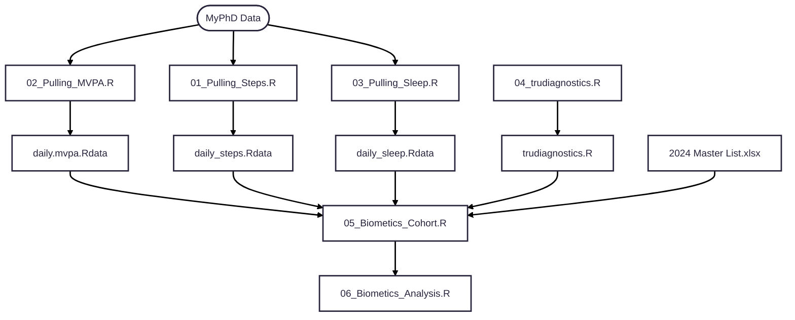

# DCI Biometics Study Analysis Plan

Summary:

Data Sources: 
- Wearables Data: https://drive.google.com/drive/folders/1-620o1al0SIuvaSOfgV1gNzT2OJN6rH7?usp=drive_link
  - Prior to analyses, update file in Terminal.
    
      gsutil -m cp -r "gs://dci-wellness-study" "/Users/lauragraham/Library/CloudStorage/GoogleDrive-lagraham@stanford.edu/Shared drives/Secure: DCI Research/Analysis_Graham/Wearables Data/Data Downloads"
    
      May also require: % gcloud auth login. 

- TruDiagnostics Data: https://drive.google.com/drive/folders/18DAzDidiQoPj5Sf7qeJf2vb6WxW1plLe?usp=drive_link

